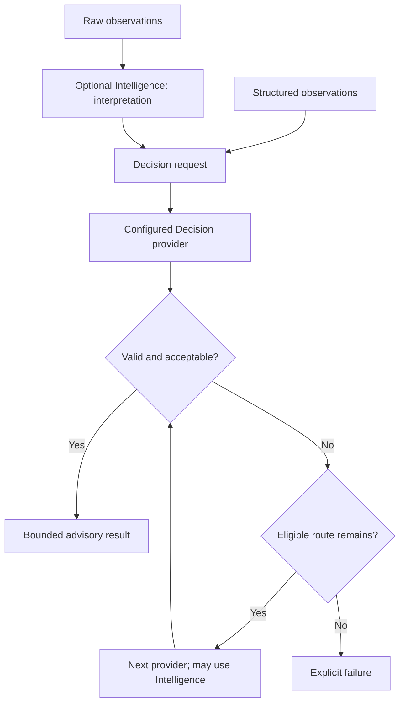
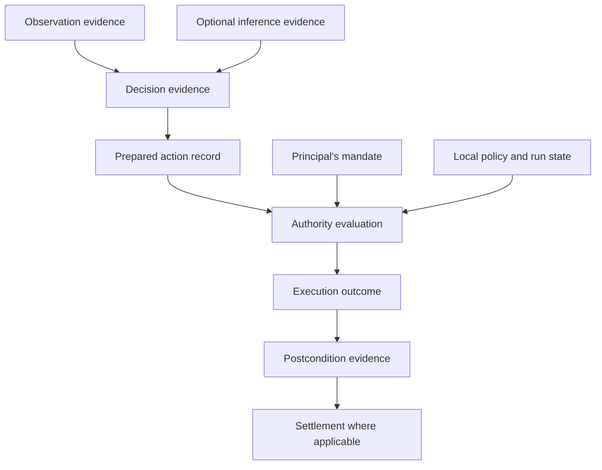

# TOTEM INTELLIGENCE & DECISION — PURPLE PAPER

## Decision First. Intelligence on Demand. Explicit Authority.

**Version 0.3 — September 2026**
**Status: Revised Draft / Architectural Synthesis**
**Totem Edge**

---

# Abstract

Autonomous systems need to choose what to do, determine whether they may do it, and establish what happened afterwards. These are separate responsibilities.

Totem places bounded Decision at the centre of this process. An application supplies state and a defined semantic problem: a choice among candidates, an ordered score, a probability estimate, or an operation with compatible targets. The Decision runtime routes that request to configured providers, validates their outputs, applies acceptance conditions, and returns either an advisory result or an explicit failure.

Many decisions can be resolved by deterministic logic or a specialised provider. When a configured provider cannot produce an acceptable result, the runtime can escalate to another provider, including an Intelligence adapter for generative reasoning. That output remains subject to the same semantic constraints. Intelligence may also be used independently to interpret raw observations before a decision is requested.

Intelligence is available where it is useful. It is not a mandatory predecessor to Decision.

Decision and Intelligence serve advisory analysis, software workflows, economic coordination and physical systems. A result may remain information, inform another computation, or become the basis for a consequential action. Standalone Intelligence can also serve applications that never invoke Decision.

An accepted Decision result grants no permission to act. When action is required, application code translates it into the relevant operation request. The governed Edge path provides preparation, effect derivation, policy and Authority evaluation before execution. Payments, network publication and physical control require different definitions of those effects. Industrial Action supplies the specialised preparation and execution machinery for physical operations; it is one consumer of proposals within this broader architecture.

Evidence connects these stages without confusing their meanings. A Decision receipt records a computation. An Authority decision records a permission evaluation. An execution receipt records a reported outcome. Physical verification and economic settlement require their own evidence and conditions.

The governing principle remains:

**AI proposes. Totem authorizes.**

Its operational meaning is precise: bounded reasoning produces proposals; governed execution authorizes the derived effects of prepared operations.

---

# 1. The Problem: Choice Is Becoming Consequential

A software agent can recommend a supplier, propose a transaction, select a charging station or request a machine adjustment. Each recommendation can cross into a system that moves money, changes infrastructure or affects people.

The statement “open valve 3” is information. Opening valve 3 is a physical operation. Permission to perform that operation must come from an independently enforced authority boundary.

This distinction holds regardless of how the recommendation was produced. A deterministic rule can propose an inappropriate action. A small model can be uncertain. A generative model can return a convincing but invalid answer. A human can request an operation beyond their delegated scope.

Trustworthy autonomy therefore requires more than a capable model. It requires defined choices, explicit acceptance rules, controlled execution and evidence that preserves the distinction between a recommendation, a permission and an outcome.

---

# 2. Decision First, Intelligence on Demand

Totem's recommended approach is to begin with the least costly suitable mechanism that can meet the application's quality, latency, privacy and assurance requirements.

A thermostat selecting among known modes may need only a rule. A robot choosing among tracked objects may use a specialised model. A maintenance agent interpreting an unfamiliar service note may benefit from generative reasoning.

For bounded semantic tasks, Decision provides a common contract around those mechanisms. Its providers may themselves perform inference; “Decision-first” does not mean that the first provider is necessarily non-AI. It means that the application begins with a constrained problem and explicit acceptance conditions.

The runtime follows configured route order. It does not automatically rank providers by intelligence, price, size or safety. A specialist-first route followed by Intelligence is a deliberate application configuration.

Escalation increases the available reasoning capability. It does not increase execution authority.

---

# 3. The Public Loop

Totem's public loop remains:

**SENSE → PROVE → DECIDE → ACT → SETTLE**

This is a description of responsibilities, rather than a requirement that every workflow invoke every package in a fixed sequence.

| Responsibility | Meaning in this paper |
|---|---|
| Sense | Obtain observations from sensors, software or external services. |
| Prove | Establish relevant identity, integrity and provenance, subject to the evidence's trust assumptions. |
| Decide | Evaluate a bounded semantic request, using configured providers and optional Intelligence. |
| Act | Translate the proposal, prepare the operation, derive effects, authorize and execute. |
| Settle | Resolve applicable payment, service or other obligations under their own conditions. |

Evidence can be produced throughout the loop. An observation may already be structured enough for Decision; another may require perception first. A decision may produce advice without any subsequent action. A physical action may have no payment attached.

The Purple Paper covers useful reasoning in its own right and the boundary crossed when a result is used to act.

---

# 4. Three Destinations for a Result

Decision is a reusable semantic service. Its usefulness does not depend on an actuator or a payment being attached.

| Destination | Example | What follows |
|---|---|---|
| Information or further computation | Score an anomaly, estimate failure probability, recommend a supplier or select a document for review. | Display, retain or pass the advisory result to another computation, subject to data-access and resource controls. |
| Software or economic action | Purchase a service, propose a payment, publish a message or request a channel operation. | Translate the result into the relevant controlled workflow and enforce its permissions and effects. |
| Physical action | Derate an inverter, adjust a machine or request a robot operation. | Translate into a physical operation, with Industrial Action and device-specific controls where integrated. |

A workflow can use several destinations. A probability estimate may inform a later bounded choice; that choice may be shown to an operator; a separately approved operation may follow. None of these transitions is automatic.

Intelligence also has independent outputs: a translation, embedding, transcript or document summary may be the complete requested service. Decision adds value when the application needs an explicit semantic choice or evaluation. It need not wrap every inference call.

The same distinction applies to read-only analysis and publication. Computing a report is informational; sending that report to a counterparty is an action with a recipient, content and possible disclosure consequences.

---

# 5. Two Relationships Between Intelligence and Decision

Intelligence has two distinct roles in this architecture.

**Optional interpretation:** an application uses Intelligence to turn raw material into useful state. Vision might identify an obstacle; classification might identify a vibration pattern; language processing might extract terms from a document. The application validates and incorporates that output into the state supplied to Decision.

**Optional provider escalation:** Decision invokes an Intelligence-backed provider when the configured route reaches it. Generative reasoning addresses the existing bounded request and returns an answer for Decision to validate.

These roles can appear independently or together. Neither is mandatory.

The diagram shows semantic routing. Applications separately constrain which providers may receive data and consume resources. A terminal cancellation ends the computation; it does not initiate another route.

---

# 6. Decision: A Contract for Bounded Semantics

`@totemsdk/decision` supplies a provider-neutral runtime for typed semantic requests. It is a sibling of `@totemsdk/intelligence`, with its own `decision:*` capabilities. It is not an `intelligence:decision` domain.

The four semantics have different bounds:

| Semantic | Question | Boundary |
|---|---|---|
| `choice` | Which candidate should be selected? | Exactly one offered candidate. |
| `score` | Where does this case fall on an ordered rubric? | An offered rubric category, with ordering preserved. |
| `probability` | How likely is this proposition? | A defined proposition and a valid probability value. |
| `action` | Which operation and target should be proposed? | An offered operation and, when required, a compatible offered target. |

Probability estimation does not select an executable action. A score does not grant permission. An action answer is a semantic selection, not a device command.

The capability namespace is closed in v1: `decision:choice`, `decision:score`, `decision:probability` and `decision:action`. Arbitrary `decision:*` strings are not valid capabilities — capability checks are closed-set membership, not a prefix match.

The runtime separates untrusted provider output from its own validated outcome. It validates the answer, applies acceptance rules, and constructs request bindings, attempt records and an advisory receipt. Providers do not author those runtime-owned bindings or receipts.

---

# 7. Candidate Spaces Are Supplied by the Application

For a battery controller, an application might offer `hold`, `discharge_5kw`, `discharge_10kw` and `request_review`. A provider can return a selection from that space. If it returns `disconnect_safety_controller`, runtime validation rejects the unknown candidate.

This is an enforcement boundary around accepted output, not a claim that a model is incapable of generating invalid text.

Candidate membership also does not establish permission. An offered operation may later fail a freshness check, an interlock, a spending limit or mandate verification. The paper therefore uses **offered candidates**, rather than “permitted actions,” when discussing the Decision request.

Candidate construction is a trusted application responsibility. Offering a dangerous or incorrectly described option cannot be repaired merely by checking that the model selected its identifier.

---

# 8. Dynamic State and Operation–Target Structure

Candidate spaces can change with the environment. A robot may initially have several route options; an obstacle can remove all but a stop or hold option. Decision binds its answer to the request that contained those possibilities.

For `action`, operations and targets retain their relationship:

| Offered operation | Targets offered for that operation |
|---|---|
| `THROTTLE` | `inverter-7`, `inverter-8` |
| `INSPECT` | `inverter-7`, `inverter-8`, `inverter-9` |
| `REQUEST_REVIEW` | No target required in this example |

Selecting `THROTTLE` with `inverter-9` is invalid for this request, even though that target appears elsewhere.

The application must define how a selected identifier maps to a real operation. Selecting `THROTTLE` does not give a model an unrestricted channel for supplying a setpoint, protocol address or arbitrary command. Concrete parameters come from trusted mappings or separately validated input.

---

# 9. Explicit Provider Routing and Acceptance

A route defines which provider is eligible, which semantics it supports, applicable limits and the conditions for accepting its answer. The runtime visits routes in their configured order.

A deployment might configure:

| Order | Provider | Acceptance and routing purpose |
|---|---|---|
| 1 | Local rule or specialised provider | Resolve routine cases within declared limits. |
| 2 | Another local specialist | Handle cases requiring a different capability or quality level. |
| 3 | Intelligence adapter | Attempt generative reasoning, if data and resource policies allow it. |

This is an illustrative configuration. Laya and Jev adapters are available integration surfaces; their names alone do not establish comparative accuracy, cost or suitability.

A route can be skipped or rejected because of unavailability, capability mismatch, request limits, invalid output or failed acceptance conditions. Timeouts can lead to escalation where configured. When no route produces an acceptable result, the runtime returns an explicit failure.

Human review, a safe fallback action or a new request then belongs to application orchestration. Those outcomes should not be presented as automatic built-in human providers.

---

# 10. Intelligence Escalation Preserves the Boundary

The Intelligence Decision adapter consumes an `IntelligenceProvider` as a generative fallback. It conveys the request's state and semantic structure, including offered operation and target identifiers, and parses the returned answer. The Decision runtime then validates that answer against the original request and applies the route's acceptance rules.

An Intelligence provider does not acquire the ability to add candidates, replace acceptance rules, issue authority or invoke the selected device operation through this adapter.

The boundary rests on runtime validation. Prompt instructions asking the model to return valid identifiers are useful guidance, but are not the enforcement mechanism.

Fallback output may omit confidence. Applications must configure acceptance accordingly. If a route requires confidence and none is present, the runtime must not treat the missing value as evidence that the requirement was met.

---

# 11. Uncertainty Remains Explicit

A confidence value is not a guarantee of correctness. Provider confidence, selected-candidate probability and uncertainty over a distribution have different meanings. Their usefulness depends on calibration and the task.

Decision supports explicit acceptance conditions, including confidence and probability requirements and application predicates. For action requests, operation confidence and target confidence are **separate** fields: `operationConfidence` and `targetConfidence` (with `confidence` retained as the 0.x alias for the operation). They are never interchanged, and a target head's confidence is not converted into a probability.

Decision distributions are explicit about their contract. A provider may mark an operation or target distribution complete; complete distributions are checked for coverage and sum, provider-declared sum tolerance is honoured (Laya/Jev declare `0.02` for their rounded contracts), and providers that declare an argmax contract (Laya/Jev) have their selection checked as the distribution maximum. Missing or malformed distributions fail closed rather than being silently renormalised.

The deterministic part of the architecture is the specified routing and validation process, given its inputs and observed provider outcomes. It does not make inference reproducible, sensors infallible or external timing deterministic.

Applications should preserve the difference between:

- a structurally valid answer;
- an answer that satisfies configured acceptance conditions;
- an answer that is correct in the world;
- an operation that is authorized;
- an operation that successfully executed.

Each requires different evidence.

---

# 12. Intelligence, Local Models and QVAC

`@totemsdk/intelligence` defines provider-neutral inference contracts, capabilities, operations and result metadata. Concrete providers implement those contracts. `@totemsdk/qvac` provides the QVAC integration.

Intelligence can support language, classification, embeddings, retrieval, speech, vision and other declared domains. An interface's domain vocabulary does not establish that every configured provider implements every domain.

Local inference can reduce latency, limit data movement and support operation without a cloud connection. Self-hosted or remote inference can be appropriate where permitted. Provider replacement should preserve the application's authority boundary, while still requiring validation of the replacement provider's semantics and performance.

QVAC can supply interpretation before Decision or generative reasoning through a Decision adapter. It can also serve independent inference workloads. None of those roles grants it signing authority or raw actuator access.

Capability discovery answers whether an operation is supported. Permission to send data, incur cost or act remains a separate question.

---

# 13. Roles Across the Edge Ecosystem

The Edge action registry and ports expose several places where applications can consume Intelligence or Decision results. The following table maps plausible compositions to inspected integration surfaces. The presence of an action or port establishes an integration point, not an automatic Decision dependency.

| Area and existing surface | Intelligence can contribute | Decision can contribute | Responsibility retained by the surrounding system |
|---|---|---|---|
| Discovery and manifests: `lookup:*`, `manifest:verify` | Interpret service descriptions or application requirements. | Select among verified, eligible service offers. | Discovery, signature verification, eligibility and disclosure controls. |
| Purchasing and negotiation: Edge purchasing interfaces | Interpret needs and explain proposed terms. | Choose a supplier or one of a bounded set of counteroffers. | Protocol state, agreement binding, purchasing authority, payment and resource lifecycle. |
| Payments and liquidity: `payment:send`, `liquidity:*` | Interpret an invoice or forecast resource demand. | Select an offered payment proposal or recommend a funding action. | Recipient and amount validation, transaction construction, spending limits and signing. |
| Omnia: channel, payment and settlement actions | Interpret demand or channel-use patterns. | Recommend an offered channel operation or service option. | Routing algorithms, channel rules, transaction validation and authorization. |
| Evidence and identity: `proof:*`, `identity:*` | Summarise evidence or identify inconsistencies for review. | Score a case or select the next evidence item to inspect. | Cryptographic verification and the rules governing claims. |
| Location: location claims, trails and proofs | Interpret movement patterns or flag suspicious observations. | Select a review response or an application-defined dispatch option. | Measurement provenance, location verification and operational permission. |
| Messaging: `transport:publish`, `transport:send` | Summarise an event or draft a message. | Select an offered response or publication destination. | Recipient/topic controls, content validation and transmission permission. |
| Physical operations: registered Industrial Action definitions | Interpret sensor data or support a reasoning fallback. | Select an offered operation and compatible target. | Preparation, interlocks, authority, actuation and outcome verification. |

These are application-level uses, not claims that the listed packages already invoke Decision internally. A deployment must supply the mappings, policy and evidence links for the composition it chooses.

Semantic reasoning also remains distinct from deterministic mechanisms. Transaction coin selection, shortest-path routing, signature verification, canonical hashing and threshold checks retain their existing roles. An application can use Decision to choose an objective or evaluate alternatives around those mechanisms without relabelling the mechanisms themselves as semantic Decision.

---

# 14. Two Edge Runtime Surfaces

The distinction between computation and consequential execution is visible in Edge hosting.

| Surface | Relevant responsibility |
|---|---|
| `createEdgeRuntime()` | Dispatches Intelligence and Decision operations through configured ports, with capability checks and an optional policy gate. |
| `createAgentEdgeRuntime()` | Resolves registered action definitions, prepares operations, derives canonical effects, authorizes and reserves, then executes through private interfaces. |

Calling `decision:decide` on the ordinary Edge runtime does not turn the result into a governed world action. An optional policy check on a compute call is also not equivalent to the prepared-effects authorization path.

An application that exposes both capabilities to an agent must preserve that separation. Compute access should not become a route around the governed action facade.

---

# 15. The Application Handoff

A successful Decision outcome is advisory. Application or orchestration code decides whether to use it and constructs the resulting action request.

That handoff must preserve the meaning of the accepted result. It maps selected identifiers to registered actions and concrete resources, supplies validated parameters, checks relevant freshness and retains correlation with the decision evidence.

For example, `THROTTLE` / `inverter-7` may map to a registered action with a defined power limit, ramp rate and resource identity. Those concrete details must be prepared and evaluated independently. The Decision receipt cannot serve as an execution token.

The same handoff applies to software and economic operations. A selected offer ID must resolve to verified terms and a recipient; a selected publication destination must resolve to an allowed topic or endpoint. Free-form model text should not silently become the transaction or network command.

Decision remains independent of the consumer. Payment infrastructure, purchasing workflows, publication interfaces and Industrial Action can each consume application-translated proposals without needing to know which provider produced the recommendation.

---

# 16. Payments, Channels and Purchasing

Decision can help an application choose among suppliers, offered payment plans or channel-management options. Intelligence can interpret invoices, service descriptions and demand forecasts. These are useful inputs to an economic workflow; neither service possesses spending authority.

The inspected Edge registry contains `payment:send` and Omnia actions for payments, channels, settlement and related operations. It also exposes liquidity reads. An application can use those observations to construct a bounded request, then map an accepted result into a separately authorized economic operation.

## Payments and Omnia: overlapping purpose, distinct interfaces

These interfaces overlap in economic purpose. They should not be read as a requirement to execute every payment twice or as two completely independent economic systems.

| Interface | Inspected role | Integration interpretation |
|---|---|---|
| `payment:send` | Calls the generic payment port with recipient, amount and token; its optional builder hook is described as an L1 payment builder. | A general payment request whose actual mechanism depends on the injected port. |
| `omnia:pay` / `omnia:pay-multihop` | Invoke Omnia payment operations. | Explicit channel-payment mechanisms. |
| Omnia channel and settlement actions | Open, change, close or settle channel arrangements. | Lifecycle operations with their own effects; they are not all equivalent to a new purchase payment. |

Because the generic payment port is injected, the interface alone does not establish that it can never delegate to Omnia. The architecture therefore needs an explicit mapping from an economic intent to an execution mechanism. A simple application may expose one payment facade and select the mechanism internally. An application that exposes both interfaces must enforce consistent permission and accounting across them.

One obligation should map to one intended payment execution, with retries correlated to that operation. A legitimate workflow can also contain distinct funding, channel-transfer and settlement operations; its accounting must distinguish those phases instead of counting every movement as a separate purchase or omitting consequential movements. Route-specific mandates may differ, but changing the interface must not bypass the principal's applicable spending limits.

Decision can help choose among offered service or payment options where semantic trade-offs matter. Ordinary rail selection can remain deterministic. Neither approach needs to duplicate the underlying payment operation.

Transaction preparation must establish the security facts that matter: recipients, assets, amounts, fees and relevant channel changes. The prepared-effects helpers can derive spend information from built outputs while distinguishing change and channel-internal outputs. Ordinary transaction construction and routing remain deterministic infrastructure underneath the proposal.

The current integration has limits that must remain visible. Built-transaction derivation depends on configured builder hooks. Without them, the inspected payment definition derives effects from the prepared request's amount and recipient; some Omnia paths similarly derive effects from request fields. Moreover, payment execution calls `pay()` with parameters, while Omnia execution removes the built draft before invoking its port. These definitions alone do not prove that the exact transaction inspected during preparation is the one ultimately executed. Trusted port implementations must preserve that relationship, and integrations should test it explicitly.

Purchasing also has its own orchestration surface. The SDK exports buying and negotiation interfaces, typed trade terms, proposal digests and purchase lifecycle records. That protocol is distinct from the semantic Decision runtime and should not be described as automatically passing through Industrial Action or every step of the generic action registry.

A Decision-backed negotiation strategy is a possible application integration: it could choose among offered counterterms within explicit limits. The negotiation protocol still owns round progression and agreement identity, while the purchasing workflow retains authorization, payment, resource activation and settlement responsibilities.

---

# 17. Industrial Action Prepares the Real Operation

`@totemsdk/industrial-action` provides the lifecycle for context-aware physical operations. Its `toEdgeActionDefinition()` adapter plugs an industrial definition into the governed Edge action registry.

Preparation validates parameters and context, evaluates configured guardrails and interlocks, applies relevant scheduling and rate limits, checks required approvals, and constructs the prepared device operation with commitment and operation identity.

These checks depend on the action definition and configured integrations. Registering an action does not automatically install every possible interlock, durable store or approval system.

After preparation, the definition's `deriveEffects(prepared)` supplies the canonical security facts used for authorization. This makes the adapter and its effect derivation part of the trusted execution boundary. They must accurately describe the prepared operation.

**Totem authorizes the derived effects of the prepared operation, rather than relying on the agent's description of its intent.**

That is a stronger basis for control, while remaining dependent on correct adapters, adequate state and appropriate device enforcement.

---

# 18. The Governed Execution Sequence

For an operation using the governed Edge action registry, the sequence is:

1. The application translates the accepted proposal into an action request.
2. The governed runtime resolves the registered action and checks capability.
3. The registered definition prepares the relevant operation. For physical actions, the Industrial Action adapter performs its configured checks; other actions use their own preparation logic.
4. The action definition derives canonical effects from the prepared operation.
5. `GrantBoundAutonomyPolicy.authorizeAndReserve()` evaluates the request against the applicable mandate, local bounds and run state, and reserves usage when approved.
6. The registered execution path invokes the appropriate payment, channel, publication, proof or device interface.
7. The runtime records the result and completes the reservation lifecycle; the application verifies any required postconditions.

A rejection or request for human intervention prevents the normal execution step. Passing preparation does not imply authorization, and passing authorization does not guarantee successful execution.

The strength of effect-based enforcement depends on what each definition derives and what the configured policy evaluates. Several inspected software actions return empty spend, fee and channel collections. This does not make publication, signing or proof creation consequence-free. It means that those financial-effect fields alone do not describe content, recipients or claim semantics; suitable action-specific validation and controls remain necessary.

Industrial Action participates both before authorization, through preparation, and after it, through execution and outcome handling. Drawing it only as a final actuator box hides half of its responsibility.

---

# 19. Policy, Authority and Three Meanings of Decision

The SDK uses “decision” in several contexts. They must remain distinguishable.

| Term | Meaning |
|---|---|
| Semantic Decision | A bounded result from `@totemsdk/decision`. |
| Policy evaluation | Evaluation of rules, local autonomy limits and run conditions. |
| Authority decision | Evaluation of delegated permission, including mandate and scope. |
| Governance decision | An institutional or collective outcome that may change policies or mandates. |

A high-confidence semantic result may still exceed the agent's budget. A policy-compliant operation may still lack a valid mandate. An Authority decision identifier is not a semantic Decision receipt identifier.

For autonomous runs, permission depends on a valid applicable mandate, satisfied local restrictions, acceptable derived effects and available run capacity. Signed authority establishes delegated scope; it does not validate the accuracy of a model or the safety of every possible device implementation.

Private keys, unrestricted signing and raw privileged ports remain outside the model-facing interface. An authorized workflow can cause signing internally without giving the model the signing primitive.

---

# 20. Three Different Escalations

Escalation must identify what is being changed.

| Escalation | Trigger | What changes |
|---|---|---|
| Provider escalation | No acceptable result from the current route | Another configured computation provider is attempted. |
| Human review | Uncertainty, exception or approval requirement | A person reviews the request through an application workflow. |
| Authority escalation | The operation exceeds existing permission | An authorized principal may issue a new or narrower supplemental grant. |

A stronger model cannot repair an expired mandate. Human agreement with a recommendation does not bypass a required approval record. Additional authority does not make an invalid or stale semantic result valid.

When permission changes, the application must reassess the current operation under the resulting scope and conditions.

---

# 21. Freshness Is an Application-Enforced Boundary

Decision binds results to request content through digests. `isDecisionFresh(result, currentRequest)` compares request digests. Changes to relevant state, candidates, goals or instructions invalidate that binding.

The helper compares supplied requests. It does not observe the world, refresh telemetry or independently determine whether a robot's path is still clear.

Before using a result, the application must reconstruct the relevant current request and decide whether to request a new decision. Action preparation separately checks operational context, deadlines and configured interlocks.

Neither check freezes the physical world. A deployment must address changes between observation, preparation, authorization and actuation through suitable device controls, timely revalidation and independent safety mechanisms.

Governance metadata must also be distinguished from semantic inputs. A request digest is not a substitute for checking current authority.

---

# 22. Budgets, Privacy and Offline Operation

Computing an answer consumes resources even when it grants no authority over the proposed world action. Inference can incur cost, disclose data and consume time, energy or bandwidth.

Applications should constrain both the reasoning process and the resulting operations. Relevant controls include provider allowlists, data-locality rules, invocation limits, timeouts, inference spending, action spending, run duration and concurrency.

Decision's explicit routes make provider selection inspectable. They do not by themselves implement every privacy rule or account for every upstream invoice. Those controls require configured policy, provider credentials, metering and orchestration.

A fallback invoked directly through an Intelligence provider must receive equivalent controls; applications should not assume that it automatically passes through a separately configured Edge Intelligence policy gate.

Offline operation is possible where the required providers, state, authority verification and execution interfaces are locally available. Its permitted scope must account for expiry and information that cannot be refreshed, including revocation state. Receipts can be retained for later synchronization where that workflow is implemented.

---

# 23. Failure and Physical Safety

No acceptable semantic answer is a valid system outcome. The application may hold, abort, request review or invoke a separately defined fallback. The appropriate response depends on the machine and operating context.

Industrial execution also needs explicit failure behaviour. A timeout does not establish that nothing happened: a device may have acted while its acknowledgement was lost. Retrying can therefore duplicate a real effect.

Industrial Action supplies execution-policy mechanisms for bounded attempts, timeouts and declared failure handling. Durable operation tracking can support deduplication when configured. These mechanisms require device-appropriate integration; they do not make every physical operation idempotent or reversible.

Likewise, asking a controller to enter a safe state is distinct from confirming that state. Independent feedback may be required before reporting the physical outcome as verified.

Certified emergency protection and deterministic control loops retain their responsibilities. A safety trip should not wait for generative reasoning or a network round trip. Totem's bounded autonomy architecture coordinates consequential operations around those controls.

---

# 24. Evidence: Computation, Permission and Outcome

Evidence should answer a specific question and state its limits.

| Evidence | What it records | What it does not establish by itself |
|---|---|---|
| Observation provenance | Source, identity and integrity information | That the sensor or source described reality correctly. |
| Decision bindings and receipt | Request/output binding and runtime-recorded computation metadata | That the recommendation was correct or authorized. |
| Attempt records | Providers attempted and routing outcomes | Independent verification of every provider claim. |
| Authority record | A permission evaluation under specified inputs | Successful physical execution. |
| Industrial receipt | Operation binding and reported execution outcome | Independent confirmation of all physical consequences. |
| Verification evidence | Observed postconditions | More than the verifier and measurement can substantiate. |
| Settlement evidence | The recorded payment or obligation outcome | That every preceding service claim was true. |

Digests establish content binding. Signatures, attestations, trusted observation and verification supply additional properties where implemented. These mechanisms must not be conflated.

Provider-reported model identity is also different from independently attested model execution. Provenance should preserve that distinction.

---

# 25. Connecting the Evidence Graph

A complete application can link observations, optional inference, semantic decisions, prepared operations, authority records, execution outcomes and settlement. The graph must also preserve independent sources of authority.

Edges represent application-maintained references and dependencies. The semantic decision does not issue the mandate, and the existence of these packages does not automatically populate every link.

Distinct identifiers should be retained for semantic receipts, authority decisions, proposals, operations and runs. Explicit correlation makes an incident reconstructable without suggesting that one receipt proves the entire workflow.

---

# 26. Worked Example: Advisory Evidence Review

An operator asks which of several service incidents needs review first. The application gathers existing receipts, identity-verification results and incident reports. Intelligence may summarise unstructured reports; structured evidence can be used directly.

Decision evaluates an ordered urgency rubric or selects a case from the supplied list. Its accepted result is displayed with the relevant evidence and uncertainty. The workflow can end there: no payment, publication or machine operation is required.

The model's interpretation must not overwrite a cryptographic verification result. A persuasive explanation does not make an invalid signature valid, and a high risk score does not itself establish wrongdoing. If the operator later chooses to notify a provider or suspend a service, that is a separate action with its own permission boundary.

This use gives Decision value as an advisory service, including when no autonomous action is desirable.

---

# 27. Worked Example: Service Selection and Network Publication

A software agent needs a storage service with a defined locality, capacity and price range. The application discovers offers, verifies relevant manifests and filters them against non-negotiable requirements. Intelligence can interpret descriptive terms; Decision can select among the remaining offers using explicit criteria.

A successful choice remains a recommendation. Trusted application code maps the selected offer to the purchasing workflow's concrete terms and counterparty. Agreement, authorization, payment and service activation retain their own checks. Evidence of activation and usage is then assessed according to the service contract.

The application may also need to publish a status update. Intelligence can draft a summary, while Decision can choose among offered response types or destinations. Before invoking `transport:publish`, the application validates the content and binds it to an allowed topic. Selecting a known topic is not permission to disclose arbitrary data on that topic.

This is an illustrative composition of inspected discovery, purchasing and messaging surfaces. It is not a claim that a turnkey Decision-driven storage buyer or content-policy integration is already implemented.

---

# 28. Worked Example: Industrial Load Reduction

A plant application receives structured temperature, vibration and load measurements. It constructs a request offering `CONTINUE`, `DERATE` and `REQUEST_INSPECTION`, with the appropriate machine targets.

A specialised Decision provider accepts the request and returns `DERATE` / `motor-4`. If its output meets the configured acceptance conditions, no generative Intelligence call is needed.

If the specialist cannot produce an acceptable result, the configured route may reach an Intelligence adapter. It reasons over the same request and returns an answer that must pass the same semantic validation. If every route fails, orchestration follows the plant's defined failure procedure.

For an accepted derating proposal, trusted application code maps the selection to a registered industrial action and validated setpoint. Industrial Action checks context, guardrails and any configured interlocks, schedule or approval. It prepares the actual motor operation.

The action definition derives its effects. Policy and Authority then evaluate the applicable machine scope, operating limits, mandate and run budget. Only an approved request reaches normal actuation.

The application records the reported outcome and uses appropriate feedback to verify the new load. A separate machine safety controller remains responsible for its protective functions throughout.

---

# 29. Worked Example: Autonomous Energy

A battery controller already has structured charge, temperature, grid and tariff data. Decision can evaluate offered operating choices directly. Optional forecasting Intelligence may improve the state, but it is not required for every decision.

A specialist can recommend an offered discharge mode. Generative escalation is available only if configured and useful within the operational time budget.

The application converts the selected mode into a concrete inverter request. Preparation establishes the relevant parameters and context. Derived effects are evaluated against the delegated scope and local limits before execution.

If the workflow also sells electricity, the commercial transaction has its own preparation and authorization requirements. Physical dispatch, measured delivery and payment are related events with distinct evidence. An accepted energy recommendation does not automatically authorize a market trade or prove delivery.

Settlement, including through Omnia where appropriate, follows the agreed commercial conditions.

---

# 30. Worked Example: Autonomous Commerce

A procurement agent gathers offers for compute, storage, maintenance or transport. Intelligence may extract terms from unstructured responses. Where offers are already structured, the application can supply them directly to Decision.

Decision selects among the offered providers or evaluates them against a rubric. Price, service history, reputation and capacity may inform the request. Those inputs remain evidence to assess, rather than guarantees of future performance.

Trusted application code maps the accepted selection to a concrete purchase. The chosen purchasing and payment integrations must bind the agreed terms to the recipient, amount and transaction submitted for authorization and execution. Builder-based effect derivation can support this check, subject to the execution-binding limitations described above.

Delivery verification and settlement remain separate obligations. Provider escalation can improve the recommendation; it cannot enlarge the purchasing mandate.

---

# 31. Security Responsibilities

The architecture assumes that model output and external state can be wrong or hostile. Prompt injection in a document or observation must remain input data; it must not modify runtime policy, grants or privileged interfaces.

Bounded candidate validation reduces the accepted output space. It does not prevent a compromised provider from selecting a harmful option that the application offered. Protection therefore depends on several independently enforced responsibilities:

- the application constructs appropriate requests and trustworthy candidate mappings;
- Decision validates provider output and applies configured acceptance conditions;
- orchestration checks freshness and preserves the proposal-to-action relationship;
- action adapters prepare operations and accurately derive their security effects;
- policy and Authority enforce applicable scope and limits;
- device controls enforce their operational and safety constraints;
- evidence and verification distinguish intended, reported and observed outcomes.

A model should receive only the interfaces needed for its role. Exposing raw privileged ports alongside a governed facade defeats that deployment boundary.

---

# 32. Package Responsibilities and Implementation Status

| Package or integration | Role |
|---|---|
| `@totemsdk/decision` | Bounded semantic requests, configured provider routing, validation, acceptance and advisory receipts. |
| `@totemsdk/intelligence` | Provider-neutral inference contracts. |
| `@totemsdk/qvac` | QVAC implementation of Intelligence contracts. |
| `@totemsdk/edge` | Port hosting and the separate governed action runtime. |
| `@totemsdk/industrial-action` | Physical operation preparation, configured checks, execution policy and industrial receipts. |
| `@totemsdk/agent-policy` | Policy and autonomy controls, including the grant-bound authorization/reservation integration. |
| `@totemsdk/authority` | Mandate-based delegated permission evaluation. |
| Proof and graph integrations | Evidence representation, verification and correlation where wired by the application. |
| `@totemsdk/omnia` | Economic settlement infrastructure where required by the workflow. |
| Edge purchasing interfaces | Buying, bounded negotiation, terms binding and purchase lifecycle orchestration; an application can integrate semantic selection around these interfaces. |
| Edge discovery, manifest, identity and proof ports | Discovery and evidence operations that can supply inputs to semantic analysis or receive separately validated requests. |
| Edge location and transport ports | Location evidence and network communication surfaces with application-specific validation and permission requirements. |

The repository contains an **implemented Decision runtime**, not merely a proposed future package. Its presence does not establish production maturity or certify a particular deployment. Package status, tests, releases and integration evidence remain the appropriate basis for those claims.

The existing action surfaces and the proposed Decision compositions have different implementation status. The cross-ecosystem examples describe how applications can connect them; they do not establish built-in package dependencies or complete end-to-end integrations.

Three current boundaries deserve explicit attention:

**Compute hosting and governed execution remain distinct.** Decision and Intelligence dispatch on the ordinary Edge runtime should not be described as automatically traversing the full prepared-effects action lifecycle.

**Receipt correlation requires complete wiring.** The inspected Industrial Action receipt builder *can* incorporate an Authority decision ID. The inspected governed runtime calls `def.execute(prepared)`, while the Industrial Action adapter creates its receipt without passing that ID. The paper therefore does not claim that every automatically produced industrial receipt contains a complete Authority decision binding. Application integrations must verify the links they rely on.

**Effect derivation varies by action.** Payment and Omnia builder hooks enable inspection of built outputs, but fallback derivation and parameter-based port execution require additional scrutiny. Several software action definitions report no spend, fee or channel effects; their content and disclosure consequences need separate controls. A shared registry lifecycle does not establish equal effect coverage across all actions.

Similarly, semantic freshness checks, inference budget coverage, physical postcondition verification and cross-layer evidence correlation must be demonstrated in the relevant deployment.

---

# 33. Development Priorities and Network Direction

The next priorities build on the existing runtime:

1. **Complete integration evidence.** Exercise advisory workflows, service selection and purchasing, payment and publication paths, and physical operations. Where action follows, test semantic selection, translation, preparation, effect derivation, authorization and execution together, including rejection and failure paths.
2. **Strengthen correlation.** Carry the relevant semantic, authority and operation references through receipt construction and run evidence without conflating them.
3. **Demonstrate freshness and resource controls.** Verify current-state checks and account for direct inference as well as inference reached through Decision fallback.
4. **Validate physical outcomes.** Establish device-specific interlocks, timeout handling, deduplication and postcondition verification appropriate to each operation.
5. **Expand provider interoperability.** Evaluate specialist and Intelligence adapters against explicit quality, locality, latency and cost requirements.
6. **Strengthen nonphysical action boundaries.** Demonstrate prepared-to-executed transaction binding and validate publication destinations, sensitive content and claim semantics beyond financial-effect accounting.

A future network may support independently operated inference and Decision services, discovered and purchased under explicit service terms. Reputation, service receipts and assurance mechanisms could help consumers choose among them. These are network-development directions, not claims that a complete open market is already delivered by the Decision package.

Purchasing computation never transfers authority over the consuming machine. The consumer retains responsibility for candidate construction, acceptance, policy, mandates and execution.

---

# 34. The Strategic Thesis

Autonomous infrastructure needs to remain understandable as models, providers, hardware and institutions change.

Totem's contribution is the separation of responsibilities that makes those changes manageable. A bounded semantic request can be served by different providers. Intelligence can be introduced where interpretation or escalation adds value. The resulting proposal still passes through application translation, concrete preparation and independently enforced permission before it can produce a governed action.

A useful result may remain advisory. When an action follows, two complementary boundaries apply: Decision constrains the semantic answer that can be accepted, while the relevant action or purchasing integration, policy and Authority constrain execution. Industrial Action specialises that second boundary for physical operations. Evidence records the relationship and its limits across software, economic and physical systems.

The central commitments are:

**Decide within explicit bounds.**
**Use Intelligence when needed.**
**Authorize the derived effects of prepared operations.**
**Record and verify outcomes.**

**Sense. Prove. Decide. Act. Settle.**

**AI proposes. Totem authorizes.**

---

## Source and Editorial Notes

Version 0.2 replaced the original draft's mandatory Intelligence-before-Decision diagrams with optional interpretation and configured provider escalation. Version 0.3 broadens that treatment to advisory analysis, discovery, purchasing, payments, Omnia, identity and evidence review, location and network publication. It distinguishes existing action surfaces from suggested Decision compositions and adds the payment-binding and software-effect qualifications found during the expanded source review.

Implementation-specific statements were checked against the following repository files on 28 September 2026. The default-branch head observed during review was `c70baa183cbda715ada2193f35cb670ecefc96ec`. These are source inspections, not a claim that runtime or hardware tests were executed for this editorial revision.

- Decision overview and semantics — `packages/decision/src/types.ts`, `packages/decision/src/constants.ts`
- Decision routing and outcome construction — `packages/decision/src/runtime.ts`
- Decision acceptance rules — `packages/decision/src/acceptance.ts`, `packages/decision/src/validation.ts`
- Intelligence Decision adapter — `packages/decision/src/adapters/intelligence.ts`
- Intelligence contracts and domains — `packages/intelligence/src/constants.ts`, `packages/intelligence/src/types.ts`
- Ordinary Edge runtime dispatch — `packages/edge/src/runtime.ts`
- Governed Agent Edge runtime — `packages/edge/src/agent-runtime.ts`
- Industrial Action Edge adapter — `packages/industrial-action/src/edge-adapter.ts`
- Industrial receipt construction — `packages/industrial-action/src/industrial-receipt.ts`
- Built-in Edge action definitions — `packages/edge/src/actions.ts`
- Transaction effect derivation — `packages/edge/src/prepared-effects.ts`
- Edge port contracts — `packages/edge/src/ports.ts`
- Purchasing public interfaces — `packages/edge/src/purchasing/index.ts`
- Purchase lifecycle records — `packages/edge/src/purchasing/state.ts`
- Trade terms and proposal binding — `packages/edge/src/purchasing/terms.ts`

---

*Totem Intelligence & Decision — Purple Paper v0.3*

*Decision first. Intelligence on demand. Explicit authority.*

**Sense. Prove. Decide. Act. Settle.**

**AI proposes. Totem authorizes.**
