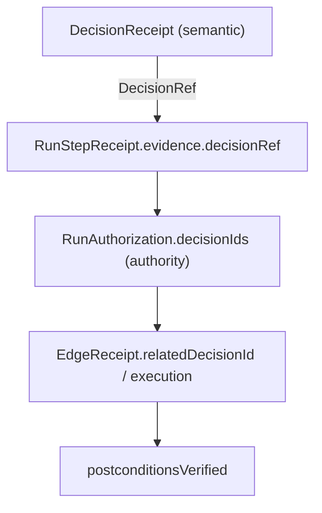

# RFC-017: Decision Receipt Graph — Linking Semantic Decisions into Governed Runs

**Status:** Draft — design specification
**Created:** 2026-09-28
**Revised:** 2026-09-28
**Authors:** Totem SDK Contributors
**Depends on:** RFC-012 (Decision runtime), RFC-010 (Industrial Action RC), RFC-004 (Edge SDK v1)
**Touches:** `@totemsdk/edge` (governed action input + receipts), `@totemsdk/agent-policy` (run receipt graph), `@totemsdk/industrial-action` (receipt binding), `@totemsdk/decision` (reference type), `@totemsdk/proofgraph` (optional persistence)

---

## 1. Summary

The Decision runtime (`@totemsdk/decision`, RFC-012) produces advisory results with a runtime-owned `DecisionReceipt` (request/state/candidate/output digests, provider identity, model/runtime provenance). The governed Edge path (`@totemsdk/edge` + `@totemsdk/agent-policy`, RFC-010) produces run receipts and industrial receipts.

Today those two evidence chains are **disjoint**. Nothing in the governed run records *which* semantic decision motivated an action, so the final graph cannot answer the question the Purple Paper calls “can we link the action to the decision, and the decision to the evidence” (Purple Paper §25).

This RFC defines an **opt-in, additive correlation** between them: a `DecisionRef` carried from the application handoff into the governed action input and recorded in the run receipt graph, the Edge receipt, and the industrial receipt — **without** conflating a semantic decision with an Authority decision, and **without** making a Decision receipt an execution token.

> This is the last unmet item in the Purple Paper's Appendix C ("Receipt integration — consequential decisions can be linked to downstream authority and action receipts").

---

## 2. Problem

A governed action can execute correctly with a policy-compliant, authority-approved receipt while the originating recommendation is unrecoverable. Conversely, a `DecisionReceipt` can exist in isolation with no trace of whether (or how) it was used. This makes the following hard:

- incident reconstruction (“why did motor-4 derate at 14:02?”);
- audit (“was this purchase actually based on the accepted supplier decision?”);
- freshness forensics (“was the decision still valid when the action ran?”);
- duplicate/independent recomputation (“did two agents act on the same recommendation?”).

The pieces exist on both sides — `DecisionReceipt.receiptId`, `outputDigest`, `requestDigest`, and `RunStepReceipt.evidence`, `RunAuthorization.decisionIds`, `IndustrialReceipt.decisionId` — but there is no defined, verified link between them.

### 2.1 Naming hazard (must be resolved by this RFC)

Three unrelated things already use the word “decision”:

| Identifier | Owner | Meaning |
|---|---|---|
| `DecisionReceipt.receiptId` | `@totemsdk/decision` | A **semantic** decision computation. |
| `RunAuthorization.decisionIds[]` | `@totemsdk/agent-policy` | **Authority/permission** decision ids. |
| `GovernanceDecision` | `@totemsdk/governance` | Institutional/collective outcome. |

`IndustrialReceipt.decisionId` currently means an **Authority** decision id (folded into `authorityBinding`). Reusing it for a semantic decision would silently swap meanings. This RFC therefore introduces a distinct `DecisionRef` and keeps the field names explicit.

---

## 3. Goals

1. Let a governed action **cite** the semantic decision that motivated it, via a compact, verifiable reference.
2. Record that reference in the run receipt graph (`RunStepReceipt.evidence`), the `EdgeReceipt`, and the industrial receipt, using **distinct field names** for semantic vs authority decisions.
3. Verify the reference at record time: if a full `DecisionSuccess` is supplied, its receipt id and digests must match the reference.
4. Keep the association **optional** and free of any trust-boundary change: a `DecisionRef` grants nothing, changes no acceptance, and cannot substitute for preparation, effects, policy or authority.
5. Preserve distinct identities so an auditor can traverse `semantic → authority → execution → settlement` without any one node claiming to prove the others.

## 4. Non-goals

- Making `decision:decide` a governed `EdgeActionDefinition` (RFC-012 §33 keeps it capability-ungated and, in v1, port-dispatched).
- Embedding full provider output or full receipts in run receipts (only references + digests).
- Treating a `DecisionReceipt` as an execution token, approval, or mandate.
- Making `@totemsdk/edge` or `@totemsdk/agent-policy` depend on a specific Decision *provider*.
- Recomputing or re-deriving decision freshness inside the governed runtime (that remains application responsibility; this RFC only defines a helper).
- Any change to `authorizeAndReserve`, mandate evaluation, or effect derivation.

---

## 5. Design

### 5.1 `DecisionRef` (new, exported by `@totemsdk/decision`, re-exported by `@totemsdk/edge`)

A compact, canonical reference to a semantic decision. It does **not** include the provider's raw output.

```ts
export interface DecisionRef {
  readonly kind: 'decision';
  /** DecisionReceipt.receiptId — the semantic decision. */
  readonly receiptId: string;
  readonly decisionKind: 'questions' | 'action';
  readonly providerId: string;
  readonly issuedAt: number;
  /** Digests copied from the runtime bindings/receipt. */
  readonly requestDigest: string;
  readonly stateDigest: string;
  readonly candidateSetDigest: string;
  readonly outputDigest: string;
  /** Optional operation/target selection, for at-a-glance correlation only. */
  readonly selected?: {
    readonly operation?: string;
    readonly target?: string;
  };
}
```

A constructor `toDecisionRef(success: DecisionSuccess): DecisionRef` copies the fields from the runtime-owned `receipt` and `bindings`. It must never accept a ref from an untrusted provider.

### 5.2 Verifying a reference

```ts
export function verifyDecisionRef(ref: DecisionRef, receipt: DecisionReceipt): boolean
```

Checks: `receipt.receiptId === ref.receiptId`, `decisionKind`, `providerId` (id match), `issuedAt`, and all four digests equal. When the application still holds the `DecisionSuccess`, the governed path may pass the full receipt to enable this check; otherwise it records the ref unverified and marks it as such.

```ts
export interface DecisionRefRecord extends DecisionRef {
  /** 'verified' only when checked against the DecisionReceipt. */
  readonly verification: 'verified' | 'unverified';
}
```

### 5.3 Carry-through points

1. **Application handoff** (Purple Paper §15): the application attaches a `decisionRef` when it translates an accepted result into an action request.
2. **`EdgeActionInput`** (`@totemsdk/edge`, governed runtime): gains an optional `decisionRef?: DecisionRefRecord`. It is *input context*, never a capability and never fed to effect derivation.
3. **`RunPreparedStep` / `AuthorizeAndReserve` evidence** (`@totemsdk/agent-policy`): the ref is recorded in `RunStepReceipt.evidence.decisionRef` alongside `simulation`, `quoteTimestamp`, `executionReceipt`, `postconditionsVerified`.
4. **`RunAuthorization`**: unchanged. Authority decision ids remain in `decisionIds[]`; the semantic ref never enters this array.
5. **`EdgeReceipt`**: gains optional `relatedDecisionId?: string` (the semantic `receiptId`), complementing the existing `relatedManifestId`/`relatedIdentityId`.
6. **Industrial receipt**: `toEdgeActionDefinition()` passes the semantic `receiptId` through as a **new, distinct** `semanticDecisionId` extra (not the existing authority-oriented `decisionId`), so `authorityBinding` and the semantic link coexist without ambiguity.

### 5.4 Run graph shape

```ts
interface RunStepReceipt {
  // …existing fields…
  evidence?: {
    simulation?: unknown;
    quoteTimestamp?: number;
    executionReceipt?: unknown;
    postconditionsVerified?: boolean;
    /** NEW */
    decisionRef?: DecisionRefRecord;
  };
}
```

The Purple Paper §25 graph becomes representable:



Each edge is an application-maintained reference. No node asserts the others' claims.

### 5.5 Freshness helper (application-invoked)

```ts
export function isDecisionRefFreshResult(
  success: DecisionSuccess,
  currentRequest: DecisionRequest,
): boolean
```

A thin, typed convenience over `isDecisionFresh` so the handoff step can assert freshness before building the action input. The governed runtime does **not** call this automatically; the application must decide whether the action's operational context has changed.

### 5.6 Trust boundary (unchanged)

- `DecisionRef` is inert metadata: it cannot add candidates, alter acceptance, satisfy policy, or grant authority.
- The governed path still authorizes on **derived effects**; the ref is recorded, not evaluated.
- A forged ref can mis-attribute provenance but cannot cause execution the policy would otherwise deny. `verifyDecisionRef` detects forgery when the receipt is available; run receipts mark `unverified` otherwise.
- Distinct fields prevent an attacker from smuggling a semantic receipt id where an Authority decision id is expected (and vice versa).

---

## 6. Compatibility

- All additions are optional fields; no existing call site breaks.
- `IndustrialReceipt.decisionId` keeps its Authority meaning; the semantic link uses `semanticDecisionId`.
- `RunAuthorization.decisionIds` is unchanged. `RunStepReceipt.evidence` gains one optional key.
- No new runtime dependency: `@totemsdk/edge` already depends on `@totemsdk/decision` (it re-exports `createEdgeDecisionPort`).

---

## 7. Security and edge cases

| Case | Behaviour |
|---|---|
| No `decisionRef` supplied | Nothing recorded; behaviour identical to today. |
| Full `DecisionSuccess` available | `verifyDecisionRef` must pass; on mismatch the ref is recorded `unverified` and surfaced, never silently dropped. |
| Ref present, receipt unavailable | Recorded `unverified`; graph keeps the reference but does not assert it. |
| Semantic receipt id supplied as `authorityDecisionId` | Rejected by field typing; the run graph keeps the two namespaces separate. |
| Duplicate refs across two steps | Allowed; enables detecting two actions sharing one recommendation. |
| Ref from an expired/stale decision | Recording is permitted; the application is responsible for the freshness check. The run graph preserves `requestDigest` so staleness is auditable after the fact. |

---

## 8. Implementation plan

- **P0 — Types + constructors.** `DecisionRef`, `DecisionRefRecord`, `toDecisionRef`, `verifyDecisionRef`, `isDecisionRefFreshResult`; exports. Add `decisionRef?` to `EdgeActionInput`, `relatedDecisionId?` to `EdgeReceipt`.
- **P1 — Governed runtime wiring.** Record `decisionRef` on `RunStepReceipt.evidence` in `createAgentEdgeRuntime`; propagate to the `EdgeReceipt`; keep `RunAuthorization` untouched.
- **P2 — Industrial binding.** `toEdgeActionDefinition()` forwards `semanticDecisionId` into `createIndustrialReceipt`, distinct from the existing `decisionId`.
- **P3 — Verification + graph.** Verify when a receipt is supplied; expose the run graph traversal helper; optional `@totemsdk/proofgraph` persistence of the linked nodes.
- **Tests.** (a) ref survives handoff → prepare → authorize → execute and appears in the graph; (b) forged ref is marked `unverified`; (c) authority ids and semantic ids never mix; (d) omitting the ref changes no behaviour; (e) two steps citing one decision are both recorded.

---

## 9. Open questions

- **Q1** Should `DecisionRef` live in `@totemsdk/decision` (proposed) or a neutral `@totemsdk/proof`/shared evidence package, given edge already re-exports decision?
- **Q2** Should an `unverified` ref cause a run to be *flagged* in `totals`, or remain a pure graph annotation?
- **Q3** Should the receipt-graph traversal helper live in `agent-policy` (owns `RunReceiptGraph`), `edge`, or `proofgraph`?
- **Q4** Do insight/telemetry consumers want the semantic `selected.operation`/`target` in the ref, or should the graph store only digests to minimise embedded decision content?
