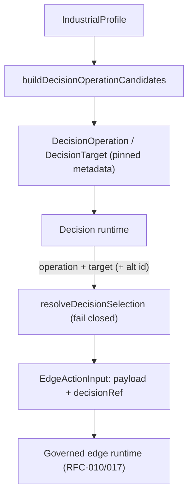

# RFC-021: Industrial Action Catalogue & Decision Binding — Registered Definitions as Bounded Decision Candidates

**Status:** Draft — design specification
**Created:** 2026-09-30
**Authors:** Totem SDK Contributors
**Reviewers:** [Pending stakeholder assignment]
**Depends on:** RFC-011 (Industrial Action Domain Model), RFC-012 (Decision Runtime), RFC-017 (Decision Receipt Graph)
**Touches:** `@totemsdk/industrial-action`, `@totemsdk/decision`, `@totemsdk/edge`, `@totemsdk/agent-policy`

---

## 1. Summary

RFC-012 lets an application ask the Decision runtime to select an **operation** (and optionally a **target**) from a dynamic candidate space. RFC-011 (and its RFC-010 companion) makes `@totemsdk/industrial-action` a governed profile over the same edge runtime, with registered `IndustrialActionDefinition`s, a `ResourceRegistry`, versioning and schema hashes.

Those two packages do not meet. Today an application that wants "the best action for this plant state" must hand-write the Decision request, then separately translate the selected `operation`/`target` string back into an industrial definition and resource — with no defined mapping. This is the exact seam where a model can select one resource while application code addresses another, or select a stale definition version.

This RFC defines the **industrial action catalogue**: a registered, versioned, hash-pinned projection of industrial definitions and resources into Decision candidates, plus an explicit **parameter-selection** model. Decision keeps its generic contract; the integration is a small, formally exported `industrial-action/decision` module. All bindings are advisory candidate metadata — nothing here grants authority, satisfies an interlock, or makes a Decision result an execution token (RFC-017 §5.6).

## 2. Motivation

### 2.1 The gap, with evidence

- Decision's action answer returns an operation and an optional target only:
  `ActionAnswer.operation`, `ActionAnswer.target` (`packages/decision/src/types.ts:232`).
  There is no parameter payload (`setChargingLimit` does **not** establish *which* limit).
- Decision requests take `operations: DecisionOperation[]` with optional
  `targets: DecisionTarget[]` (`packages/decision/src/types.ts:97`), while
  industrial definitions carry `kind`, `version`, a `schema` and a resolved
  `ResourceId` that Decision never sees.
- `@totemsdk/edge` already re-exports the RFC-017 `DecisionRef` and
  `EdgeActionInput.decisionRef` exists (`packages/edge/src/action-registry.ts:65`),
  so the *evidence linkage* is specified — but nothing populates the Decision
  side from the industrial registry.
- The industrial profile mechanism (`IndustrialProfile`,
  `packages/industrial-action/src/profiles.ts:22`) already bundles definitions,
  resources, capabilities and recipes. That bundle is the natural source of
  candidates.

### 2.2 Why this matters

The catalogue removes an entire class of "authorized-for-X / actuated-Y" defects
before they reach preparation (RFC-010 §6.4 already checks effects-match after
preparation; this RFC makes the selection itself unambiguous). It also lets the
same registered definition feed both humans and models without a second,
divergent action vocabulary.

## 3. Goals

1. Project registered industrial definitions + resources into Decision candidate
   operations/targets by a deterministic, exported function.
2. Pin every candidate to `kind`, `definitionVersion`, `schemaHash`, `resourceId`
   and protocol binding, so selection resolves back to exactly one registered
   definition and one resource address.
3. Make parameter selection explicit: a candidate may carry either trusted
   parameters or a bounded set of named alternatives, each with a payload digest.
4. Keep Decision generic: no `@totemsdk/decision` dependency on
   `@totemsdk/industrial-action`.
5. Preserve the RFC-017 trust boundary: catalogue metadata is advisory and inert.

## 4. Non-goals

- Model-generated arbitrary parameters (only validated, schema-bounded payloads).
- Making Decision a governed `EdgeActionDefinition` (RFC-012 §33).
- Changing `authorizeAndReserve`, effect derivation, or `DecisionReceipt` shape.
- Re-specifying the decision↔receipt linkage (that is RFC-017; this RFC only
  supplies the `DecisionRef.selected` correlation values).

## 5. Design

### 5.1 Package boundary

```
@totemsdk/industrial-action        (owns definitions, resources, profiles)
        ▲
        │  compiles to
        │
@totemsdk/industrial-action/decision   ← NEW subpath/entry
        │  produces
        ▼
@totemsdk/decision  DecisionRequest / DecisionOperation / DecisionTarget
```

`@totemsdk/decision` gains **no** new runtime dependency. The compiler lives in
the industrial package and imports Decision *types* only.

### 5.2 `IndustrialDecisionCatalogue`

```ts
import type { DecisionOperation, DecisionTarget } from '@totemsdk/decision';

export interface CandidateBinding {
  readonly kind: string;
  readonly definitionVersion: number;
  readonly schemaHash: string;
  readonly resourceId?: ResourceId;
  /** Address the adapter will actually use, when a resource + protocol resolve. */
  readonly protocol?: ResourceProtocol;
}

export interface ParameterSelection {
  /** How parameters are supplied. `supplied` = the caller passes `payload` at handoff. */
  readonly source: 'supplied' | 'alternatives';
  /**
   * Bounded, pre-approved alternatives. Each carries its canonical payload digest
   * so a downstream action can prove which alternative was authorized.
   */
  readonly alternatives?: readonly ParameterAlternative[];
}

export interface ParameterAlternative {
  readonly id: string;
  readonly description?: string;
  readonly payload: Record<string, unknown>;
  readonly payloadDigest: string;   // hashCanonical('TOTEM_INDUSTRIAL_ACTION_PARAMETERS_V1', payload)
}

export interface CatalogueCandidate {
  readonly operation: DecisionOperation;                 // Decision-native shape
  readonly target?: DecisionTarget;
  readonly binding: CandidateBinding;
  readonly parameterSelection: ParameterSelection;
}
```

### 5.3 Compiling a profile into a `DecisionRequest` fragment

```ts
export interface BuildDecisionCandidatesOptions {
  /** Definitions eligible for selection. Default: all registered. */
  kinds?: string[];
  /** Offer one target head per operation, drawn from the resource registry. */
  includeTargets?: boolean;
  /** Resolve the candidate targets for an operation (site policy / tenancy). */
  targetsFor?: (kind: string) => ResourceId[];
  /** Named, bounded parameter alternatives keyed by kind. */
  alternativesFor?: (kind: string) => ParameterAlternative[];
  /** Injectable clock/hash for deterministic digests. */
  now?: () => number;
}

export function buildDecisionOperationCandidates(
  profile: IndustrialProfile,
  options?: BuildDecisionCandidatesOptions,
): CatalogueCandidate[];

/** Convenience: the Decision-native operations/targets only. */
export function toDecisionOperations(
  candidates: readonly CatalogueCandidate[],
): DecisionOperation[];
```

Mapping rules:

| Industrial | Decision | Rule |
|---|---|---|
| `definition.kind` | `DecisionOperation.id` | verbatim |
| `definition.description` | `DecisionOperation.description` | verbatim |
| `binding.definitionVersion`/`schemaHash` | `DecisionOperation.metadata` | embedded, not inferred |
| `ResourceId` | `DecisionTarget.id` | `resourceIdKey(id)` |
| resource address | `DecisionTarget.metadata.binding` | protocol + endpoint |
| `ParameterSelection` | `DecisionOperation.metadata.parameterSelection` | opaque to Decision |

The compiler is **pure**: given the same profile and options it produces the same
candidate ids, metadata and payload digests. `operation.metadata` is a
`DecisionValue` (`packages/decision/src/types.ts:97`), so no Decision type change
is required.

### 5.4 Resolving a selection back to a definition + resource

```ts
export interface ResolvedSelection {
  readonly kind: string;
  readonly definitionVersion: number;
  readonly schemaHash: string;
  readonly resourceId?: ResourceId;
  readonly protocol?: ResourceProtocol;
  /** Present when the selection named one bounded alternative. */
  readonly parameterAlternative?: ParameterAlternative;
}

/** Resolve a Decision result against the catalogue it was built from. */
export function resolveDecisionSelection(
  candidates: readonly CatalogueCandidate[],
  selection: { operation: string; target?: string; parameterAlternativeId?: string },
): ResolvedSelection;
```

`resolveDecisionSelection` **fails closed** (`ActionDefinitionError`) when:

- the operation id is not in the catalogue;
- a target was selected but is not a registered target for that operation;
- a payload digest does not match the alternative named by the application.

This is the guard that prevents "select resource A, address resource B": the
target is re-derived from the industrial `ResourceRegistry`, never taken as a
free string by application code.

### 5.5 Parameter selection is explicit

Three supported modes, in order of increasing model trust:

1. **`supplied`** — trusted application code supplies the `payload`. The
   `ParameterSelection.source = 'supplied'`; the decision selects only kind/target.
2. **`alternatives`** — the catalogue offers bounded, named alternatives (e.g.
   approved charging profiles, mission plans). The model selects an alternative
   `id`; its `payload` and `payloadDigest` travel with the candidate metadata.
   This is the recommended default for anything a model may influence.
3. **validated model parameters (future)** — the model proposes a payload, which
   is validated against `definition.schema` (`assertValidParameters`) *before*
   preparation. This RFC specifies the hook (`ParameterSelection.source =
   'supplied'` with a `origin: 'model'` marker in context) but does not enable
   model-authored parameters by default.

### 5.6 Handoff into the governed runtime (with RFC-017)

At handoff the application:

1. calls `resolveDecisionSelection(...)`;
2. builds `EdgeActionInput` with `payload` (supplied or the chosen alternative's
   payload), `decisionRef` (RFC-017 `toDecisionRefRecord`), and any
   `idempotencyKey`;
3. invokes `runtime.executeAction(input)`.

The selected target is passed via the same `resolveResourceId` option the
adapter already consumes (`packages/industrial-action/src/edge-adapter.ts:172`),
so the resource resolved at preparation is exactly the one the catalogue pinned.



## 6. Compatibility

- Additive: a new exported compiler and resolver; no existing type changes.
- `DecisionOperation.metadata` already exists, so Decision is untouched.
- Absent the catalogue, applications keep hand-building requests.

## 7. Security considerations

| Case | Behaviour |
|---|---|
| Selected target not registered for the operation | `resolveDecisionSelection` throws; no action prepared. |
| Definition version/hash drift between selection and preparation | RFC-011 §4.5 `expectedVersion`/`expectedSchemaHash` fail closed at `toEdgeActionDefinition`. |
| Payload digest mismatch | Rejected before preparation. |
| Model selects an operation absent from the catalogue | Rejected; catalogue is the closed candidate set. |
| Decision output as authority | Impossible by construction: catalogue metadata is inert (RFC-017 §5.6); authority comes only from `authorizeAndReserve`. |

## 8. Implementation plan

- **P0 — Types.** `CatalogueCandidate`, `CandidateBinding`, `ParameterSelection`,
  `ParameterAlternative`, `ResolvedSelection`; exports from the new subpath.
- **P1 — Compiler.** `buildDecisionOperationCandidates`, `toDecisionOperations`,
  deterministic ids/digests.
- **P2 — Resolver.** `resolveDecisionSelection` with fail-closed checks.
- **P3 — Handoff helper.** `buildGovernedActionInput(candidate, selection, refs)`
  returning an `EdgeActionInput` (no execution).
- **P4 — Tests.** (a) round-trip profile → candidates → selection → definition;
  (b) unknown operation/target/digest rejected; (c) stable output across runs;
  (d) no `@totemsdk/decision` runtime dependency added; (e) selection with a
  target resolves to the same `ResourceAddress` the adapter would use.

## 9. Open questions

- **Q1** Should the compiler live in `@totemsdk/industrial-action` (proposed) or a
  neutral bridge package to keep Decision/industrial decoupled at build time?
- **Q2** Should `ParameterAlternative.payloadDigest` use the commitment domain
  (`TOTEM_INDUSTRIAL_ACTION_COMMITMENT_V2`) so it participates in authority
  binding, or a distinct parameters domain (proposed)?
- **Q3** Do target heads need per-operation capability scoping (a tenancy filter)
  in v1, or is `targetsFor` sufficient?
- **Q4** Should the catalogue record the `DecisionRequest` digest it was built
  for, so a stale catalogue is detectable at handoff?

## 10. References

- `docs/rfc/RFC-010-INDUSTRIAL-ACTION-RC.md` — governed edge adapter, version binding
- `docs/rfc/RFC-011-INDUSTRIAL-ACTION-DOMAIN-MODEL.md` — resources, profiles, versioning
- `docs/rfc/RFC-012-DECISION-RUNTIME.md` — Decision request/result contract
- `docs/rfc/RFC-017-DECISION-RECEIPT-GRAPH.md` — `DecisionRef` handoff and trust boundary
- `packages/decision/src/types.ts` — `DecisionOperation`, `DecisionTarget`, `ActionAnswer`
- `packages/industrial-action/src/{profiles,resources,versioning,edge-adapter}.ts`
- `packages/edge/src/action-registry.ts` — `EdgeActionInput`, `decisionRef`
