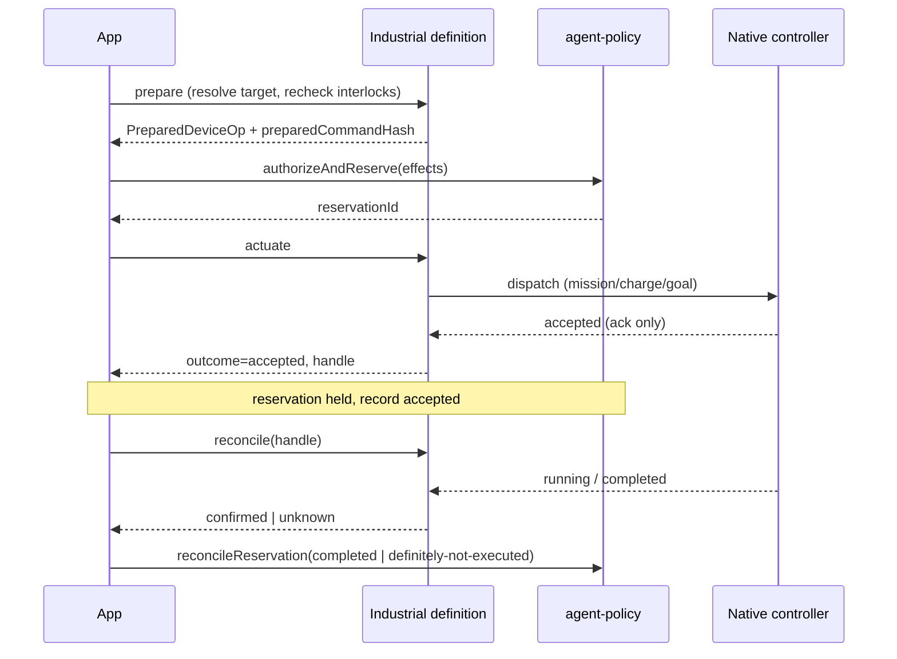

# RFC-022: Prepared-Command Binding & Asynchronous Operation Lifecycle

**Status:** Draft — design specification
**Created:** 2026-09-30
**Authors:** Totem SDK Contributors
**Reviewers:** [Pending stakeholder assignment]
**Depends on:** RFC-010 (Industrial Action RC), RFC-011 (Industrial Action Domain Model), RFC-017 (Decision Receipt Graph), RFC-019 (Governed Agent Commerce — reconciliation primitives)
**Touches:** `@totemsdk/industrial-action`, `@totemsdk/edge`, `@totemsdk/agent-policy`

---

## 1. Summary

Two correctness gaps sit immediately downstream of RFC-010/011:

1. **The commitment does not cover the prepared command.** `computeCommitmentHash`
   binds `kind`, `parameters`, `context` and `mandateProofId`
   (`packages/industrial-action/src/ids.ts:23`) — not the `DeviceOpBase` that
   `prepare` returns (`edge-adapter.ts:68`). Nothing enforces that `prepare` is
   deterministic, so a non-pure `prepare` (or a resource resolved off-schema by
   `resolveResourceId`, `edge-adapter.ts:172`) can produce a command that no
   authorized commitment describes.
2. **Every synchronous success is `confirmed`.** `runWithPolicy` returns
   `outcome: 'confirmed'` whenever `actuate` reports `ok`
   (`edge-adapter.ts:427`). For long-running devices (missions, charging
   sessions, navigation goals) an accepted command is not a completed one, and
   the durable record is closed as terminal.

RFC-019 already built the **reconciliation half** of the answer: `classifyFailure`
(`packages/edge/src/action-registry.ts:86`) lets a definition return `'unknown'`,
and the agent runtime then **holds** the reservation for explicit
`reconcileReservation` (`packages/edge/src/agent-runtime.ts:178-189`;
`packages/agent-policy/src/grant-bound-autonomy.ts:319`) rather than releasing
budget or double-spending. This RFC extends that model to (a) bind the prepared
command, and (b) give long-running operations a durable asynchronous lifecycle
with progress, cancellation and reconciliation — without inventing a second
reservation system.

RFC-017's `DecisionRef` carry-through is already implemented and is not restated
here; this RFC records the **authorization and reservation ids** alongside it.

## 2. Motivation

### 2.1 Prepared-command binding

`prepare` is documented as "build the real device operation from validated
inputs" (`edge-adapter.ts:155`) but is not required to be pure, and the resolved
resource is not schema-bound. The authorized effects are derived from the
prepared op (`deriveEffects`, `edge-adapter.ts:325`), so authorization is
*already* over the command — but the **commitment** that an auditor and the
receipt graph see does not name the command, protocol binding, definition
version or resolved target. A retry, a config reload between prepare and execute,
or a non-deterministic `prepare` can therefore diverge from the committed intent.

### 2.2 Asynchronous operation semantics

| Event | What it actually establishes |
|---|---|
| Command accepted by a controller | The controller *will attempt* it — not that it happened (e.g. MAVLink `COMMAND_ACK`). |
| Command completed | The device reports the action finished. |
| Observed result | Telemetry readback confirms the physical outcome. |

Collapsing these into `confirmed` makes reconciliation impossible: the durable
record (`operation-store.ts:82`) transitions straight out of `in-flight`, and a
lost acknowledgement has nowhere to live.

## 3. Goals

1. Add a **canonical prepared-command digest** covering resolved target, protocol
   binding, definition version, schema hash and command content; include it in
   the commitment.
2. Enforce **prepare purity/binding**: resolve the target through the
   `ResourceRegistry` (not a free string) and make the digest stable across
   retries.
3. Preserve a **stable invocation ID** across retries while allowing a genuinely
   new request to perform the same operation again.
4. Add a durable **asynchronous operation state machine** (`submitted` →
   `accepted` → `running` → terminal/`unknown`) with progress, cancellation and
   readback-confirmed completion.
5. Route uncertain post-dispatch outcomes through the existing RFC-019
   reservation-hold + `reconcileReservation` path, and carry reservation/authority
   ids into the industrial receipt.

## 4. Non-goals

- Re-specifying RFC-017 `DecisionRef` (already implemented).
- Re-implementing reservation hold/release: RFC-019 owns it
  (`reconcileReservation`, `classifyFailure`).
- Physical-effect *enforcement* (policy-side) — RFC-023.
- Any change to `authorizeAndReserve` beyond accepting a prepared-command digest.

## 5. Design

### 5.1 Canonical prepared-command digest

```ts
/** RFC-022 §5.1 — canonical digest of the device command actually prepared. */
export interface PreparedCommandBinding {
  readonly resourceId?: string;          // from the ResourceRegistry, not free text
  readonly protocol?: ResourceProtocol;  // resolved address protocol
  readonly endpoint?: string;            // resolved address endpoint
  readonly definitionVersion: number;
  readonly schemaHash: string;
  /** Canonical, adapter-declared serialization of the prepared command. */
  readonly command: unknown;
}

export function computePreparedCommandHash(binding: PreparedCommandBinding): string {
  return hashCanonical('TOTEM_INDUSTRIAL_ACTION_PREPARED_COMMAND_V1', binding);
}
```

`PreparedDeviceOp` gains `preparedCommandHash: string`. The adapter must expose a
**canonical command serializer** so the same logical command hashes identically
across runs:

```ts
export interface IndustrialActionDefinition<TResult = unknown> {
  // …existing fields…
  /**
   * Deterministic canonical form of the prepared command. Defaults to the
   * command object itself; adapters whose wire form is non-canonical (maps,
   * floats, ordering) MUST override it.
   */
  canonicalizeCommand?(command: unknown): unknown;
}
```

### 5.2 Binding the command into the commitment

Extend the commitment preimage (a deliberate pre-RC breaking change, domain
bumped to `V3`):

```ts
computeCommitmentHash({
  kind, parameters, context, mandateProofId,
  preparedCommandHash,            // NEW
})
```

Because the operation id is `computeOperationId(commitmentHash, resourceId)`
(`ids.ts:76`), binding the command also pins the operation id to the exact
prepared command and target.

### 5.3 Target resolution is schema-bound and registry-resolved

- `resolveResourceId` moves from an ad-hoc callback to a **declared target
  parameter** in the schema: the definition names which parameter carries the
  target, and the adapter resolves it through the `ResourceRegistry`.
- If the resolved `ResourceId` is not registered, preparation fails closed
  (`ActionValidationError`) before authorization.
- The resolved `ResourceAddress.protocol`/`endpoint` are recorded in the
  binding, so the receipt proves *which wire address* was addressed.

### 5.4 Stable invocation vs. a new request

| Concept | Derivation | Purpose |
|---|---|---|
| `commitmentHash` | kind + params + context + mandate + **preparedCommandHash** | what was authorized |
| `operationId` | `computeOperationId(commitmentHash, resourceId)` | at-most-once dedup (existing) |
| `invocationId` | caller-supplied `idempotencyKey` (RFC-019 P1-3) | stable across retries |
| `operationHandle` | durable handle minted on first dispatch | async progress/reconcile |

A retry reuses the same `invocationId`, resolving to the same `operationId` and
durable record. A genuinely new request uses a new `invocationId`, producing a
distinct `commitmentHash`/`operationId` and a new handle, so "do it again" is
possible without weakening dedup.

### 5.5 Asynchronous operation state machine

Replace the binary `in-flight`/terminal model in `operation-store.ts:23` with an
explicit lifecycle. New statuses are additive:

```ts
export type OperationStatus =
  | 'in-flight'      // pre-dispatch or single-shot (existing)
  | 'submitted'      // dispatched, awaiting acceptance
  | 'accepted'       // controller acknowledged, not complete
  | 'running'        // progress reported
  | 'reconciling'    // outcome unknown, reserved held (RFC-019)
  | ActionOutcome;   // terminal: confirmed | failed | unknown | aborted | …

export interface DeviceOperationRecord {
  operationId: string;
  invocationId?: string;
  proposalId?: string;
  status: OperationStatus;
  attempts: number;
  outcome?: ActionOutcome;
  /** Durable handle returned by the adapter (mission id, session id, goal id). */
  handle?: unknown;
  /** Adapter-declared progress, monotonic where available. */
  progress?: { fraction?: number; detail?: string; at: number };
  cancelRequested?: boolean;
  reservationId?: string;        // RFC-019 authority reservation to reconcile
  authorityDecisionId?: string;  // recorded, distinct from semantic (RFC-017)
  updatedAt: number;
  result?: unknown;
}
```

Definition-side contract:

```ts
export interface AsyncOperationSupport<TResult = unknown> {
  /**
   * What a successful actuate response establishes. Default: 'completed'
   * (back-compatible single-shot behaviour).
   */
  readonly confirmation: 'accepted' | 'completed';
  /** Poll current state for a handle; called by reconciliation. */
  reconcile?(op: PreparedDeviceOp, record: DeviceOperationRecord): Promise<OperationProgress<TResult>>;
  /** Request cancellation. Best-effort; the controller may refuse. */
  cancel?(op: PreparedDeviceOp, record: DeviceOperationRecord): Promise<void>;
}

export interface IndustrialActionDefinition<TResult = unknown> {
  // …existing fields…
  async?: AsyncOperationSupport<TResult>;
}
```

`runWithPolicy` changes: if `def.async?.confirmation === 'accepted'`, a successful
`actuate` yields `outcome: 'accepted'` (non-terminal) and the record stays
`accepted`/`running`; only a confirmed readback yields `confirmed`. A
post-dispatch uncertainty yields `'reconciling'` with the reservation held.

### 5.6 Reconciliation, cancellation and restart

```ts
export interface OperationLifecycle {
  /** Advance an accepted/running/reconciling operation by polling its adapter. */
  reconcile(operationId: string): Promise<DeviceOperationRecord>;
  /** Request cancellation; result is `unknown` until reconciled. */
  cancel(operationId: string): Promise<DeviceOperationRecord>;
  /** List operations needing attention (e.g. after restart). */
  open(now: number): Promise<DeviceOperationRecord[]>;
}
```

- **Reconcile** calls `def.async.reconcile`, then either completes the record
  (`confirmed`/`failed`) or leaves it `reconciling`.
- When a record leaves `reconciling`, the caller settles the RFC-019 reservation:
  `policy.reconcileReservation(reservationId, 'completed' | 'definitely-not-executed')`
  (`grant-bound-autonomy.ts:319`). Only an explicit `definitely-not-executed`
  releases budget — the same rule RFC-019 enforces today.
- **Cancel** sets `cancelRequested` and calls `def.async.cancel`; cancellation
  does **not** establish zero consumption until reconciled (mirrors
  `reservation-recovery.test.ts:96`).
- On restart, `open()` returns non-terminal records so the host can reconcile.

### 5.7 Pre-dispatch recheck

Immediately before dispatch (in `prepare` for single-shot, or before the first
`actuate` for async), the adapter re-evaluates interlocks and relevant telemetry
(`interlocks.evaluate`, `edge-adapter.ts:259`). If the operation must change, a
**new** `PreparedDeviceOp` (new prepared-command digest, new operation id) must be
prepared and authorized — the original commitment is never mutated.

### 5.8 Evidence: authorization + reservation ids in the receipt

Extend the industrial receipt (already carries `decisionId` and
`authorityBinding`, `industrial-receipt.ts:38`):

```ts
export interface IndustrialReceiptExtras {
  // …existing…
  reservationId?: string;
  semanticDecisionId?: string;   // RFC-017, distinct from authority `decisionId`
  preparedCommandHash?: string;
  handle?: unknown;
}
```

An auditor can then traverse: semantic decision → authority decision →
reservation → prepared command → execution → observed result.



## 6. Compatibility

- `confirmation` defaults to `'completed'`, preserving single-shot semantics.
- New `OperationStatus` members are additive; existing `in-flight`→terminal paths
  still work.
- Commitment domain bumps to `V3` (pre-RC breaking change; see RFC-010 Q1
  precedent). Old `V2` commitments fail closed rather than being reinterpreted.

## 7. Security considerations

| Case | Behaviour |
|---|---|
| Non-deterministic `prepare` | `preparedCommandHash` mismatch between attempts → record held, never silently re-dispatched. |
| Target resolved off-registry | Prepare fails closed before authorization. |
| Lost acknowledgement | `reconciling` + reservation held; only explicit reconcile releases budget. |
| Cancel treated as success | Rejected: cancellation is `unknown` until reconciled. |
| Replay after terminal success | Same `operationId` returns the durable record (dedup). |
| New request after success | New `invocationId` → new commitment/operation id. |

## 8. Implementation plan

- **P0 — Types.** `PreparedCommandBinding`, `computePreparedCommandHash`,
  `canonicalizeCommand`, extended `DeviceOperationRecord`, `OperationLifecycle`.
- **P1 — Binding.** Include `preparedCommandHash` in the commitment (`V3`);
  schema-bound target resolution via the registry; record protocol/endpoint.
- **P2 — Async.** `AsyncOperationSupport`, `confirmation`, state transitions,
  `runWithPolicy` acceptance semantics.
- **P3 — Lifecycle.** `reconcile`/`cancel`/`open`; settle RFC-019 reservations.
- **P4 — Evidence.** Receipt extras; carry `reservationId` + `semanticDecisionId`.
- **P5 — Tests.** stale observations, changed target, altered command, duplicate
  dispatch, lost acknowledgement, restart recovery, cancel-then-reconcile.

## 9. Open questions

- **Q1** Should `preparedCommandHash` be committed separately (a `commitmentV3`
  field) or folded into the existing preimage (proposed)?
- **Q2** Is `confirmation: 'completed'` the right default, or should long-running
  capable adapters be required to declare it explicitly?
- **Q3** Where does the reconciliation scheduler live — the adapter host, a
  durable `@totemsdk/edge` loop, or `agent-policy`?
- **Q4** Should `handle` be a typed protocol (opaque bytes + scheme) rather than
  `unknown`, for cross-adapter persistence?

## 10. References

- `docs/rfc/RFC-010-INDUSTRIAL-ACTION-RC.md` — commitment, idempotency, execution policy
- `docs/rfc/RFC-011-INDUSTRIAL-ACTION-DOMAIN-MODEL.md` — resources, failure semantics
- `docs/rfc/RFC-017-DECISION-RECEIPT-GRAPH.md` — `DecisionRef` carry-through
- `docs/rfc/RFC-019-GOVERNED-AGENT-COMMERCE.md` — `classifyFailure`, reservation hold/reconcile
- `packages/industrial-action/src/{ids,edge-adapter,operation-store,industrial-receipt}.ts`
- `packages/edge/src/agent-runtime.ts` — reservation hold path
- `packages/agent-policy/src/grant-bound-autonomy.ts` — `reconcileReservation`
