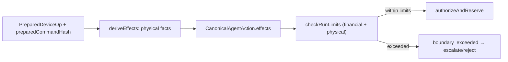

# RFC-023: Physical-Effect Policy Enforcement — Extending `StepEffects` to Enforceable Physical Limits

**Status:** Draft — design specification
**Created:** 2026-09-30
**Authors:** Totem SDK Contributors
**Reviewers:** [Pending stakeholder assignment]
**Depends on:** RFC-022 (Prepared-Command Binding & Async Lifecycle), RFC-011 (Industrial Action Domain Model), RFC-010 (Industrial Action RC)
**Touches:** `@totemsdk/agent-policy`, `@totemsdk/industrial-action`, `@totemsdk/edge`, `@totemsdk/authority`

---

## 1. Summary

`StepEffects` (`packages/agent-policy/src/run.ts:34`) models **financial and
channel** effects — `spends`, `fees`, `channels`, plus an untyped
`stateChanges`. `checkRunLimits` (`packages/agent-policy/src/autonomy.ts:80`)
enforces per-run ceilings over those effects (`maxStepSpend`, `maxGrossSpend`,
`maxFees`, `maxOutstandingChannelExposure`).

Industrial actions have physical effects that matter just as much for safety and
authority — instantaneous power, total energy, speed, duration, and a mission
envelope — but there is no typed place for them in `StepEffects` and no ceiling
in `RunLimits`. Adapters can already derive such facts (RFC-011 `deriveEffects`,
`packages/industrial-action/src/edge-adapter.ts:325`), but the policy layer
neither sees nor enforces them; at best they are recorded as opaque
`stateChanges`.

This RFC adds typed **physical effects** to `StepEffects` and matching
**physical limits** to `RunLimits`, enforced by `checkRunLimits` on the effects
derived from the **prepared command** (RFC-022), never from caller hints. This
is what turns "the adapter records a power draw" into "the mandate can refuse it".

## 2. Motivation

### 2.1 Effects are the authorization substrate

The governed runtime authorizes on **derived effects**, not on descriptions:
`CanonicalAgentAction.effects` is what `authorizeAndReserve` commits to
(`packages/edge/src/agent-runtime.ts:94-114`; RFC-010 §6.4 "the effects the
runtime derived"). Today that substrate cannot express "≤ 22 kW", "≤ 40 kWh",
"≤ 120 s" or "within mission envelope E". A charging action, a drone mission or a
drivetrain command therefore has no way to be *bounded* by policy — only
observed after the fact.

### 2.2 The pieces exist, unenforced

- Adapters derive effects from the prepared op (`industrial-action`), so the
  values are trustworthy and commitment-bound.
- `RunLimits` already implements the enforcement *pattern* for money
  (`checkRunLimits`), including boundary escalation (`escalateGrossSpend`).
- What is missing is the **type** and the **ceiling**.

### 2.3 Physical vs. semantic authority must stay distinct

A physical limit is an **authority/governance** fact. It must be enforced the
same way spending is — in policy — and must not be satisfiable by a semantic
`DecisionRef` or by any model-supplied value (RFC-017 §5.6, RFC-012).

## 3. Goals

1. Add typed physical effects to `StepEffects`: resource identity, power,
   energy, speed, duration, and mission-envelope references.
2. Add matching ceilings to `RunLimits` with the same accumulate/escalate
   semantics as spending.
3. Enforce them in `checkRunLimits`, on effects derived from the prepared command.
4. Keep dimensions explicit and unit-safe (reuse RFC-011 units/quantities).
5. Preserve back-compatibility: absent physical effects, behaviour is unchanged.

## 4. Non-goals

- Replacing `stateChanges` (kept for non-enforceable, descriptive state).
- Real-time control-loop enforcement (the native controller owns stabilization);
  this is *pre-authorization and per-run* enforcement.
- Making physical effects the source of truth for device safety — interlocks and
  safe-state (RFC-011 §4.3/§4.11) remain primary.

## 5. Design

### 5.1 Typed physical effects

Extend `StepEffects` (`run.ts:34`) with an optional, additive section:

```ts
export interface PowerEffect {
  /** Resource the effect applies to (ResourceId key). */
  resource: string;
  /** Instantaneous ceiling the prepared command will draw/emit. */
  watts: string;                 // decimal string, avoid float drift
}

export interface EnergyEffect {
  resource: string;
  /** Total energy the prepared command can consume/produce. */
  wattHours: string;
}

export interface SpeedEffect {
  resource: string;
  /** Speed ceiling implied by the prepared command. */
  metresPerSecond: string;
}

export interface DurationEffect {
  resource: string;
  /** Maximum wall-clock duration the operation may run. */
  seconds: string;
}

export interface EnvelopeRef {
  /** Opaque, registered envelope id (e.g. a mission plan). */
  envelopeId: string;
  /** Canonical digest of the envelope the command was bounded against. */
  envelopeDigest: string;
}

export interface PhysicalEffects {
  power?: PowerEffect[];
  energy?: EnergyEffect[];
  speed?: SpeedEffect[];
  duration?: DurationEffect[];
  /** Mission/operation envelopes the prepared command is confined to. */
  envelopes?: EnvelopeRef[];
}

export interface StepEffects {
  spends: StepEffect[];
  fees?: StepEffect[];
  channels?: ChannelEffect[];
  stateChanges?: Record<string, unknown>;
  physical?: PhysicalEffects;    // NEW
}
```

Physical effects are derived **only** from the prepared operation (RFC-022
`preparedCommandHash`), so they are commitment-bound and cannot be forged by
caller hints — the same rule `deriveEffects` already follows.

### 5.2 Matching run limits

Extend `RunLimits` (`run.ts:62`) with physical ceilings, mirroring the spending
shape (per-step and per-run, plus aggregate):

```ts
export interface PhysicalLimits {
  /** Per-step instantaneous power ceiling. */
  maxStepPower?: { watts: string };
  /** Per-run aggregate energy ceiling. */
  maxEnergy?: { wattHours: string };
  /** Per-step speed ceiling. */
  maxSpeed?: { metresPerSecond: string };
  /** Per-run aggregate duration ceiling. */
  maxDurationSeconds?: { seconds: string };
  /** Envelopes the run may operate within (membership, not a numeric ceiling). */
  allowedEnvelopes?: string[];
}

export interface RunLimits {
  // …existing…
  physical?: PhysicalLimits;
}
```

### 5.3 Enforcement in `checkRunLimits`

`checkRunLimits` gains a physical pass after the financial passes
(`autonomy.ts:110-157`), using the same `boundary_exceeded` result and the same
aggregate-state pattern (`state.spentByToken` → a new
`state.energyByResource` / `state.durationByResource`):

```ts
if (action.effects.physical) {
  const Lp = profile.runLimits.physical;
  for (const p of action.effects.physical.power ?? []) {
    if (Lp?.maxStepPower && gte(p.watts, Lp.maxStepPower.watts)) {
      return { kind: 'boundary_exceeded', reason: 'maxStepPower', boundary: 'run.maxStepPower' };
    }
  }
  for (const e of action.effects.physical.energy ?? []) {
    if (Lp?.maxEnergy) {
      const used = state.energyByResource[e.resource] ?? '0';
      if (gt(add(used, e.wattHours), Lp.maxEnergy.wattHours)) {
        return escalatePhysical(profile, 'run.maxEnergy', e, action.runId);
      }
    }
  }
  for (const s of action.effects.physical.speed ?? []) {
    if (Lp?.maxSpeed && gt(s.metresPerSecond, Lp.maxSpeed.metresPerSecond)) {
      return { kind: 'boundary_exceeded', reason: 'maxSpeed', boundary: 'run.maxSpeed' };
    }
  }
  for (const d of action.effects.physical.duration ?? []) {
    if (Lp?.maxDurationSeconds) {
      const used = state.durationByResource[d.resource] ?? '0';
      if (gt(add(used, d.seconds), Lp.maxDurationSeconds.seconds)) {
        return { kind: 'boundary_exceeded', reason: 'maxDurationSeconds', boundary: 'run.maxDurationSeconds' };
      }
    }
  }
  for (const env of action.effects.physical.envelopes ?? []) {
    if (Lp?.allowedEnvelopes && !Lp.allowedEnvelopes.includes(env.envelopeId)) {
      return { kind: 'boundary_exceeded', reason: 'envelopeNotAllowed', boundary: 'run.allowedEnvelopes' };
    }
  }
}
```

Boundary escalation reuses the existing shape (`escalateGrossSpend` →
`escalatePhysical`) so an over-limit physical effect produces the same
`request_narrow_grant`/`reject` choices as an over-limit spend.

### 5.4 Mandate constraints for physical facts

Because `stepSpendByToken` flows into `MandateConstraint` evaluation
(`packages/authority/src/types.ts:24`), physical facts should be constrainable
the same way. The canonical action's physical effects are exposed to mandate
constraints under stable field names:

| Field | Meaning |
|---|---|
| `physical.power.watts` | per-step power |
| `physical.energy.wattHours` | per-run energy |
| `physical.speed.metresPerSecond` | per-step speed |
| `physical.duration.seconds` | per-run duration |
| `physical.envelopes` | envelope membership |

This lets a grantor issue a mandate of the form
`{ field: 'physical.power.watts', operator: 'lte', value: '22000' }` and have it
enforced by the existing authority path.

### 5.5 Adapter obligation

Every profile that can produce physical effects (RFC-024–027) must:

1. derive them in `deriveEffects` from the prepared op only;
2. use canonical units (kW/W, kWh, m/s, s) with decimal strings;
3. declare the envelope digest from the actual bounded plan (mission, charging
   profile, route), so the effect proves *which* envelope bounded the command.



## 6. Compatibility

- `physical` is optional; a `StepEffects` without it behaves exactly as today.
- `RunLimits.physical` is optional and defaults to no physical ceiling.
- Existing `stateChanges` consumers are unaffected; physical facts are additive.

## 7. Security considerations

| Case | Behaviour |
|---|---|
| Caller supplies physical hints | Ignored; effects come from the prepared op only. |
| Physical effect exceeds a ceiling | `boundary_exceeded` before authorization; escalation or reject. |
| Envelope id not allowed | Rejected; envelope must be in `allowedEnvelopes`. |
| Envelope digest mismatch | The command is not confined to the declared plan → reject. |
| Model claims a safe power | Irrelevant: effects are derived, not asserted. |
| Float precision drift | Decimal strings, no floating-point comparison. |

## 8. Implementation plan

- **P0 — Types.** `PhysicalEffects` + members; `StepEffects.physical`;
  `PhysicalLimits`; `RunLimits.physical`; exports.
- **P1 — Enforcement.** Physical pass in `checkRunLimits`; aggregate counters
  (`energyByResource`, `durationByResource`) threaded through the run state store.
- **P2 — Escalation.** `escalatePhysical` mirroring `escalateGrossSpend`.
- **P3 — Mandate fields.** Expose physical facts to `MandateConstraint` matching.
- **P4 — Industrial derivation.** Helper in `industrial-action` to build
  `PhysicalEffects` from `PreparedDeviceOp` + declared limits.
- **P5 — Tests.** power/energy/speed/duration/envelope within and over limits;
  escalation shape; hint-forgery ignored; unit canonicalisation.

## 9. Open questions

- **Q1** Should physical limits be per-resource (proposed, via resource-keyed
  aggregates) or per-run totals across all resources?
- **Q2** Are decimal strings sufficient, or should quantities reuse RFC-011
  `Quantity` (value + unit) end-to-end in `StepEffects`?
- **Q3** Does envelope membership belong in `RunLimits` or in authority
  constraints only?
- **Q4** Should `maxDurationSeconds` measure authorization-to-completion (covering
  async operations, RFC-022) or dispatch-to-completion?

## 10. References

- `docs/rfc/RFC-010-INDUSTRIAL-ACTION-RC.md` — derived effects as the authorization substrate
- `docs/rfc/RFC-011-INDUSTRIAL-ACTION-DOMAIN-MODEL.md` — quantities/units, safe-state
- `docs/rfc/RFC-017-DECISION-RECEIPT-GRAPH.md` — semantic vs authority separation
- `docs/rfc/RFC-022-PREPARED-COMMAND-BINDING-ASYNC-LIFECYCLE.md` — effects from the prepared command
- `packages/agent-policy/src/{run,autonomy,grant-bound-autonomy,run-state-store}.ts`
- `packages/authority/src/types.ts` — `MandateConstraint`
- `packages/industrial-action/src/edge-adapter.ts` — `deriveEffects`
