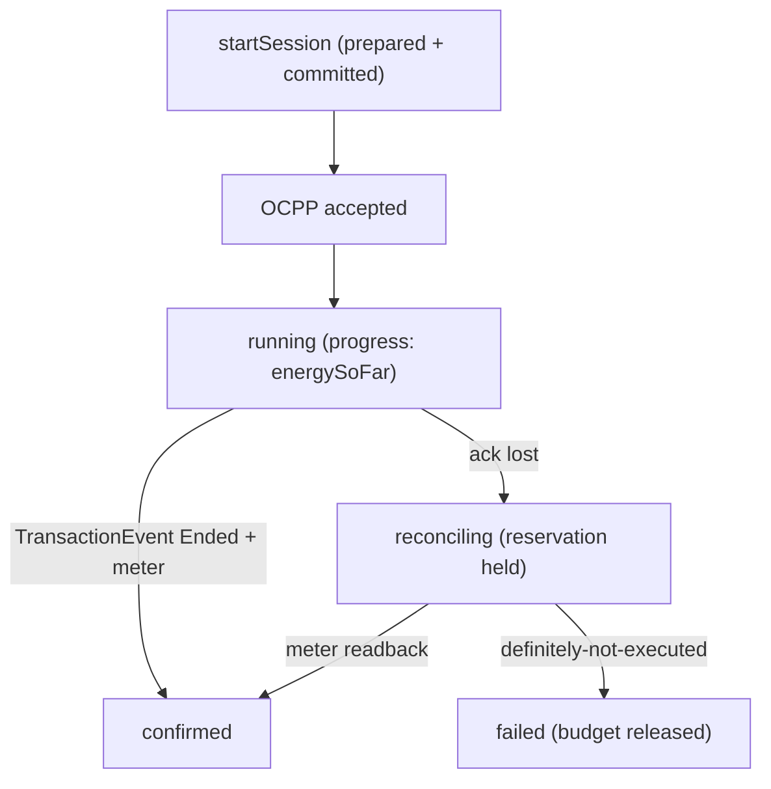

# RFC-024: OCPP / EV Charging Profile — `@totemsdk/industrial-ocpp`

**Status:** Draft — design specification
**Created:** 2026-09-30
**Authors:** Totem SDK Contributors
**Reviewers:** [Pending stakeholder assignment]
**Depends on:** RFC-021 (Catalogue & Decision Binding), RFC-022 (Prepared-Command Binding & Async Lifecycle), RFC-023 (Physical-Effect Policy Enforcement), RFC-011 (Domain Model)
**Touches:** new package `@totemsdk/industrial-ocpp`; `@totemsdk/industrial-action`; `@totemsdk/edge`

---

## 1. Summary

EV charging is the strongest first commercial demonstrator for governed
industrial action: it has a mature, documented control protocol (OCPP), real
financial consequences (energy settlement), physical safety limits (power,
energy, connector state) and naturally asynchronous sessions. This RFC specifies
`@totemsdk/industrial-ocpp`: an RFC-011 **profile** that registers charging
resources, interlocks, error taxonomy and definitions, plus a bounded OCPP
adapter, so start/stop, charging-limit, reservation and session/meter
reconciliation all execute through the governed edge runtime (RFC-010) with the
prepared-command binding and async lifecycle of RFC-022 and the physical-effect
limits of RFC-023.

The adapter owns **OCPP wire semantics only**. Totem supplies mission authority,
bounded execution and evidence; the charger (and its charging-management system)
retains electrical protection and the control loop.

> **External facts in this RFC are hypotheses to verify and pin, not
> established claims.** §9 lists them explicitly. No implementation should
> depend on them until the verification tasks there are complete.

## 2. Motivation

### 2.1 Why charging first

- Bounded, enumerable operations with unambiguous physical effects
  (power/energy), which RFC-023 can enforce.
- Inherently asynchronous: a session is submitted → accepted → running →
  completed, exactly the RFC-022 lifecycle.
- Metering produces settlement evidence, linking governed industrial action to
  governed financial action through the same runtime.

### 2.2 What exists

- `@totemsdk/industrial-action` profiles already bind resources to protocol
  addresses and wire units (`profiles.ts`, `resources.ts`).
- The device error taxonomy (`error-taxonomy.ts`) is the extension point for
  OCPP status/error mapping.
- No charging profile or OCPP adapter exists today.

## 3. Goals

1. A reference profile: charging resources, connector safe-state, charging
   interlocks, OCPP error taxonomy, and a small set of governed definitions.
2. A bounded OCPP adapter implementing the RFC-022 async lifecycle (sessions,
   progress, cancel, reconcile).
3. Physical effects (power/energy) derived from the prepared command and enforced
   per RFC-023.
4. Metering evidence that supports settlement, carrying reservation/authority ids
   (RFC-022 §5.8).
5. Explicit, versioned OCPP capability negotiation and a documented migration
   path.

## 4. Non-goals

- Implementing a charging-management system or an OCPP stack from scratch;
  foundations are reused (§5.1).
- Bidirectional/DER services in v1 (OCPP 2.1) — designed for, not shipped.
- Electrical protection, BMS, or connector safety — owned by the charger.
- Payment processing — Totem's governed financial actions own that.

## 5. Design

### 5.1 Foundation reuse (not reimplementation)

| Concern | Foundation | Totem role |
|---|---|---|
| Charging-management system (central system side) | a maintained TypeScript/Node CMS (e.g. CitrineOS) or the deployment's own CSMS | bind its operations to governed definitions |
| Charger-side OCPP stack | a modular charger stack supporting OCPP 1.6/2.0.1/2.1 (e.g. EVerest) | drive it through an adapter port |
| Governed execution | `@totemsdk/edge` + RFC-010 | authoritative lifecycle |

The adapter must depend on these only through **injected ports**, matching the
existing `edge-*` convention (`packages/edge-modbus/package.json` depends only
on `@totemsdk/edge`; the wire transport is injected).

### 5.2 Package shape

```
@totemsdk/industrial-ocpp
  src/transport.ts      OcppTransportPort (injected: CSMS or charger stack)
  src/adapter.ts        OCPP operations → PreparedDeviceOp + actuate/reconcile/cancel
  src/profile.ts        IndustrialProfile: resources, interlocks, taxonomy, definitions
  src/effects.ts        deriveEffects → PhysicalEffects (RFC-023)
  src/meter.ts          meter-value reconciliation → settlement evidence
  src/capabilities.ts   OCPP version/capability negotiation (explicit, versioned)
```

### 5.3 Governed operations (initial)

| Definition kind | OCPP action | Effect | Failure mode | Async |
|---|---|---|---|---|
| `charging:startSession` | `RemoteStartTransaction` / `RequestStartTransaction` | write | `fail-safe` | accepted |
| `charging:stopSession` | `RemoteStopTransaction` / `RequestStopTransaction` | write | `fail-safe` | accepted |
| `charging:setLimit` | `SetChargingProfile` (Tx/`ChargingProfile`) | write | `fail-safe` | accepted |
| `charging:reserveConnector` | `ReserveNow` | write | `fail-closed` | accepted |
| `charging:clearProfile` | `ClearChargingProfile` | write | `fail-safe` | accepted |
| `charging:readMeter` | `MeterValues` (readback) | read | `fail-silent` | completed |

Each definition declares a `canonicalizeCommand` (RFC-022 §5.1) so the prepared
command digest is stable across retries, and an `AsyncOperationSupport` whose
`confirmation` is `'accepted'`.

### 5.4 Resource and safe-state model

```ts
// Connector as a resource; the EVSE/charger as its parent asset.
export interface ChargingResourceMeta {
  readonly connectorId: number;
  readonly maxPowerWatts: string;       // physical ceiling at this connector
  readonly phases: 1 | 3;
  readonly connectorType?: string;      // e.g. 'Type2', 'CCS2'
}
```

`SafeState` for a connector is **stop the session / set 0 A** (never leave an
active transaction). A `fail-safe`/`fail-closed` definition targeting a
connector without a declared safe-state is rejected at registration (RFC-011
§4.11), reusing `runProfileConformance`.

### 5.5 Physical effects (RFC-023)

`deriveEffects` computes, from the prepared command only:

```ts
{
  physical: {
    power:    [{ resource, watts: profileLimitWatts }],
    energy:   [{ resource, wattHours: plannedEnergyCeiling }],
    duration: [{ resource, seconds: maxSessionSeconds }],
    envelopes:[{ envelopeId: chargingProfileId, envelopeDigest }],
  }
}
```

A `SetChargingProfile` maps to a `ChargingProfile` envelope; the envelope digest
is `hashCanonical` over the canonical profile schedule, so the receipt proves
which schedule bounded the command.

### 5.6 Async session lifecycle and reconciliation

Maps directly onto RFC-022 §5.5:

1. `startSession` dispatches; OCPP acceptance ⇒ `accepted` (not `confirmed`).
2. `reconcile` polls `MeterValues`/`TransactionEvent`; a session that reaches
   `Ended` with a final meter reading ⇒ `confirmed`.
3. Lost acknowledgement ⇒ `reconciling`; the RFC-019 reservation stays held.
4. `cancel` maps to `stopSession`; cancellation is `unknown` until reconciled.



### 5.7 Metering and settlement evidence

`meter.ts` extracts a canonical, signed-by-the-charger meter value (transaction
id, timestamp, energy register, measurand) and attaches it to the industrial
receipt (`IndustrialReceiptExtras`). Because the same runtime executes governed
financial actions, a settlement action can cite the charging receipt by
`operationId`, giving one evidence chain: start → energy consumed → meter value
→ settlement.

### 5.8 Capability negotiation and versioning

- `capabilities.ts` performs an **explicit** OCPP version/capability handshake
  (e.g. OCPP 2.0.1 profile set) and records the negotiated set in the profile
  version and in candidate metadata (RFC-021).
- Definitions are versioned (RFC-011 §4.5); a capability change is a new profile
  version, never a silent upgrade.
- OCPP 2.1 (bidirectional/DER) is an **extension**: new definitions under the
  same profile, gated by the negotiated capability.

### 5.9 Error taxonomy

Register OCPP `status`/`reason` codes into the device error taxonomy
(`error-taxonomy.ts`), classifying at minimum: connector fault/`Unavailable`
(`safety`), `Occupied`/`Reserved` (`permanent`), timeout/offline (`transient`),
authorization failure (`auth`). No OCPP error may be classified `transient`
unless a retry is genuinely safe (a retried `RemoteStartTransaction` must remain
idempotent via `operationId`).

## 6. Compatibility

- New package; no change to existing packages beyond consuming RFC-021–023.
- The profile is data + injected ports; deployments without a CSMS still get the
  definitions and can inject a simulator.

## 7. Security considerations

| Case | Behaviour |
|---|---|
| Charge command exceeds connector/contract power | RFC-023 physical limit rejects before authorization. |
| Connector without safe-state | Definition rejected at registration. |
| Replayed start after accepted session | Same `operationId` returns the durable record. |
| Meter value forged by caller | Meter evidence must originate from the charger transport, not caller payload. |
| Unnegotiated OCPP feature | Definition gated by capability; absent ⇒ not selectable. |

## 8. Implementation plan

- **P0 — Package + transport port.** Skeleton mirroring `edge-modbus`;
  `OcppTransportPort`.
- **P1 — Profile.** Resources, connector safe-states, interlocks, error taxonomy.
- **P2 — Operations.** Start/stop/limit/reserve/clear with canonical commands
  and RFC-022 async support.
- **P3 — Physical effects.** `deriveEffects` + RFC-023 limits on a real connector.
- **P4 — Metering.** Meter reconciliation + receipt evidence.
- **P5 — Capability negotiation.** Versioned handshake; OCPP 2.0.1 profile.
- **P6 — E2E.** Simulated CSMS/charger; the RFC-022 adversarial case set
  (stale observation, changed target, altered command, duplicate dispatch, lost
  ack, restart recovery).
- **P7 — OCPP 2.1 extension.** Bidirectional/DER, capability-gated.

## 9. External dependencies to verify and pin

> Each item below is stated as a **claim from the originating review**; treat as
> unverified until the listed task is done. Pin exact versions/commits and record
> them in `SDK_MANIFEST`/package docs.

| Claim | Verification task |
|---|---|
| A maintained TypeScript/Node charging-management system (e.g. CitrineOS) is suitable as the CSMS foundation | Evaluate repo activity, license, OCPP version coverage; record decision |
| A modular charger-side stack (e.g. EVerest) supports OCPP 1.6/2.0.1/2.1 | Confirm supported versions and integration surface |
| The standalone `libocpp` repository is archived and development moved | Confirm authoritative maintained location before depending on it |
| OCPP 2.1 adds bidirectional/DER capabilities | Confirm against the OCPP 2.1 specification; scope the extension |
| Metering evidence is sufficient for settlement | Agree the settlement evidence contract with the financial-action owner |

## 10. Open questions

- **Q1** Does the adapter talk to the CSMS (central) or the charger (local), or
  both? Which is authoritative for reconciliation in each deployment?
- **Q2** Should charging profiles be modelled as RFC-011 recipes (multi-step
  session setup) or as single actions?
- **Q3** What is the settlement evidence contract — meter value alone, or meter +
  contract/ tariff reference?
- **Q4** How are roaming/eMSP flows represented without conflating them with the
  local authorization path?

## 11. References

- `docs/rfc/RFC-010-INDUSTRIAL-ACTION-RC.md` — governed execution
- `docs/rfc/RFC-011-INDUSTRIAL-ACTION-DOMAIN-MODEL.md` — profiles, resources, safe-state
- `docs/rfc/RFC-021-INDUSTRIAL-CATALOGUE-DECISION-BINDING.md` — candidate binding
- `docs/rfc/RFC-022-PREPARED-COMMAND-BINDING-ASYNC-LIFECYCLE.md` — async sessions
- `docs/rfc/RFC-023-PHYSICAL-EFFECT-POLICY-ENFORCEMENT.md` — power/energy limits
- `packages/edge-modbus/src/{gateway,transport}.ts` — adapter port convention
- `packages/industrial-action/src/{profiles,resources,error-taxonomy}.ts`
