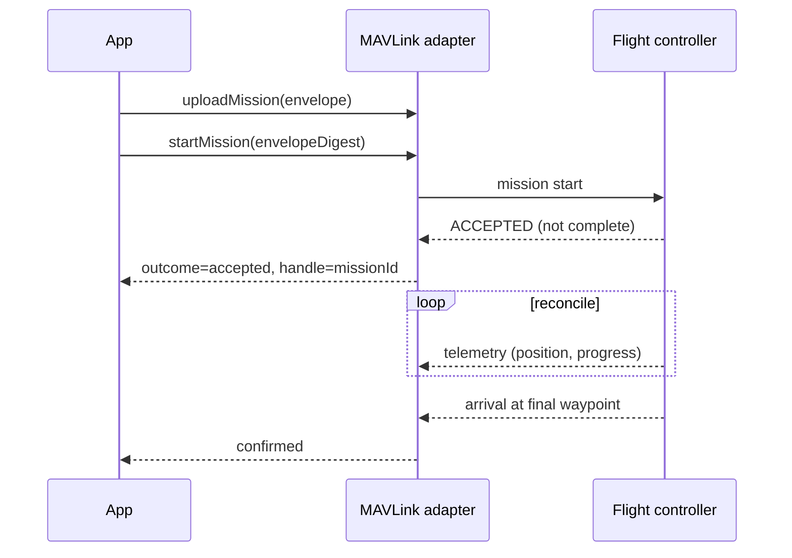

# RFC-025: MAVLink / Autonomous Flight Profile — `@totemsdk/industrial-mavlink`

**Status:** Draft — design specification
**Created:** 2026-09-30
**Authors:** Totem SDK Contributors
**Reviewers:** [Pending stakeholder assignment]
**Depends on:** RFC-024 (OCPP profile — pattern precedent), RFC-021, RFC-022, RFC-023, RFC-011
**Touches:** new package `@totemsdk/industrial-mavlink`; `@totemsdk/industrial-action`; `@totemsdk/edge`

---

## 1. Summary

Aerial vehicles are the second demonstrator: they combine a well-specified
command/telemetry protocol (MAVLink), an autopilot that owns real-time
stabilization, and long-running, safety-critical operations where *acceptance is
not completion*. This RFC specifies `@totemsdk/industrial-mavlink`: an RFC-011
profile plus a bounded MAVLink adapter that authorizes a **mission envelope** and
lets the onboard controller maintain the control loop, with the RFC-022 async
lifecycle (accepted → running → observed arrival) and RFC-023 physical limits
(geofence/envelope, speed, duration).

The adapter owns **MAVLink wire semantics only**. Totem supplies mission
authority, bounded execution and evidence; the flight controller owns
stabilization, failsafes and the real-time loop.

> **External facts in this RFC are hypotheses to verify and pin, not
> established claims.** See §9. No implementation should depend on them until
> the verification tasks are complete.

## 2. Motivation

### 2.1 Why this is the right second adapter

- MAVLink explicitly distinguishes **command acceptance** from **completion**
  (an accepted command means the controller *will attempt* it) — the precise
  motivation for RFC-022's async lifecycle.
- Flight operations are naturally bounded by a mission envelope (geofence,
  altitude, speed, duration), which maps onto RFC-023.
- Telemetry gives an independent readback path for reconciliation, distinct from
  command acknowledgement.

### 2.2 What exists

- No flight adapter exists today.
- `@totemsdk/industrial-action` provides definitions, resources, interlocks,
  error taxonomy and the RFC-022 async contract this RFC consumes.

## 3. Goals

1. A reference profile: vehicle resources, geofence/altitude/speed interlocks,
   MAVLink error taxonomy, and a narrow governed operation set.
2. A bounded adapter implementing the RFC-022 lifecycle with mission handles,
   progress, hold, return-to-launch, land, and telemetry reconciliation.
3. A **mission envelope**: upload and authorize an approved plan; the autopilot
   executes within it.
4. Start with a single autopilot target and a narrow interface; add a second
   target only after conformance testing.
5. Physical effects derived from the prepared command and enforced per RFC-023.

## 4. Non-goals

- Flight stabilization, navigation or failsafes — owned by the autopilot.
- Offboard/velocity control as a v1 governed operation (it requires continuous
  proof-of-life signalling; see §5.7). v1 governs *bounded missions*, not stick
  inputs.
- Certificated airworthiness or regulatory approval — deployment responsibility.

## 5. Design

### 5.1 Foundation reuse (not reimplementation)

| Concern | Foundation | Totem role |
|---|---|---|
| Client API / mission protocol | a MAVLink client SDK (e.g. MAVSDK) | drive via injected port |
| Autopilot | a primary autopilot (e.g. PX4) | own the control loop / failsafes |
| Simulation | the autopilot's SITL simulator | demonstrator + fault injection |

The adapter depends on these only through injected ports, matching
`edge-*`/RFC-024 conventions. A small local bridge (C++ or Python) is a
practical integration path if the SDK lacks a first-class Node binding (§9).

### 5.2 Package shape

```
@totemsdk/industrial-mavlink
  src/transport.ts      MavlinkTransportPort (injected: client SDK / bridge)
  src/adapter.ts        operations → PreparedDeviceOp + actuate/reconcile/cancel
  src/profile.ts        IndustrialProfile: vehicle resources, interlocks, taxonomy
  src/envelope.ts       MissionEnvelope model + digest + validation
  src/effects.ts        deriveEffects → PhysicalEffects (speed, duration, envelope)
  src/conformance.ts    per-autopilot conformance harness (§5.8)
```

### 5.3 Governed operations (initial, narrow)

| Definition kind | MAVLink operation | Effect | Failure mode | Async |
|---|---|---|---|---|
| `flight:uploadMission` | mission upload | write | `abort` (pre-dispatch) | completed |
| `flight:startMission` | mission start | write | `fail-safe` | accepted |
| `flight:hold` | hold / pause | write | `fail-safe` | accepted |
| `flight:returnToLaunch` | RTL | write | `fail-safe` | accepted |
| `flight:land` | land | write | `fail-safe` | accepted |
| `flight:readTelemetry` | telemetry stream | read | `fail-silent` | completed |

`startMission` and friends use `confirmation: 'accepted'` (RFC-022); completion
is established by telemetry readback (§5.6), never by the command ack.

### 5.4 Resource and safe-state model

The vehicle is an asset; its `ResourceId` addresses the autopilot. Safe-state is
**hold or land** (deployment policy chooses; an in-flight `fail-safe` must never
command a de-energize analogue). A definition targeting a vehicle without a
declared safe-state is rejected at registration.

### 5.5 Mission envelope (the core control)

```ts
export interface MissionEnvelope {
  readonly envelopeId: string;
  readonly vehicle: string;              // ResourceId key
  readonly waypoints: readonly Waypoint[];// lat/lon/alt in canonical units (RFC-011)
  readonly maxAltitudeMetres: string;
  readonly maxSpeedMetresPerSecond: string;
  readonly maxDurationSeconds: string;
  readonly geofence?: Geofence;
}
export function envelopeDigest(envelope: MissionEnvelope): string;
```

- `uploadMission` prepares and commits the envelope; the digest is bound into the
  commitment (RFC-022 §5.2) and the receipt.
- `startMission` is authorized **against the envelope digest**, so a start cannot
  reference a different plan than the one authorized.
- RFC-023 enforces `maxSpeed`/`maxDurationSeconds` and envelope membership from
  the derived effects, so a mission outside the mandate's allowed envelope is
  refused before dispatch.

### 5.6 Async lifecycle and telemetry reconciliation

1. `startMission` dispatch; `COMMAND_ACK`/mission acceptance ⇒ `accepted`.
2. `reconcile` subscribes to telemetry and advances `running` with progress
   (waypoint index, distance remaining, battery, position).
3. Observed arrival at the final waypoint (with position tolerance) ⇒ `confirmed`.
4. Lost acknowledgement or telemetry dropout ⇒ `reconciling`; the RFC-019
   reservation is held (never auto-released).
5. `cancel` ⇒ `hold` then `returnToLaunch`; cancellation is `unknown` until
   reconciled. A cancel is never treated as zero consumption
   (`reservation-recovery.test.ts` precedent).



### 5.7 Why not Offboard control in v1

Offboard-style continuous control requires a sustained proof-of-life signal from
an external controller; if that signal stops, the autopilot's failsafe engages.
This reinforces the boundary: **Totem authorizes a bounded mission; the autopilot
maintains the loop.** A future v2 may govern Offboard only with an explicit
locally-hosted, failsafe-owning design.

### 5.8 Autopilot conformance

Compatibility varies by autopilot and API surface. The profile ships a
`conformance.ts` harness that each supported autopilot must pass before it is
offered in the catalogue:

- mission upload/start/hold/RTL/land round-trip;
- acceptance-vs-completion semantics (must not report complete on ack);
- telemetry fields required for reconciliation;
- geofence/altitude rejection behaviour;
- failsafe interaction with `hold`/RTL.

A second autopilot is added as a **separate, tested profile**, not by loosening
the first.

### 5.9 Error taxonomy

Register MAVLink result/enum codes into the device error taxonomy: geofence
breach / failsafe (`safety`), mission rejected / invalid waypoint (`permanent`),
link timeout (`transient`), authorization denial (`auth`). A `safety`
classification commands safe-state and never retries.

## 6. Compatibility

- New package; consumes RFC-021–023 without modifying them.
- The profile is data + injected ports; SITL deployments need no hardware.

## 7. Security considerations

| Case | Behaviour |
|---|---|
| Start a mission not matching the committed envelope | Envelope digest mismatch → rejected before dispatch. |
| Mission exceeds mandate speed/duration/envelope | RFC-023 boundary before authorization. |
| Ack treated as completion | Rejected by design: `confirmation: 'accepted'`. |
| Telemetry spoofed to fake arrival | Arrival requires the adapter's transport-sourced telemetry; caller payload cannot assert it. |
| Cancel as implicit success | Cancellation is `unknown` until reconciled. |
| Unsupported autopilot | Not offered: conformance suite must pass. |

## 8. Implementation plan

- **P0 — Package + transport port.** Skeleton; `MavlinkTransportPort`.
- **P1 — Envelope.** Model, digest, validation; waypoint units.
- **P2 — Operations.** Upload/start/hold/RTL/land with RFC-022 async support.
- **P3 — Physical effects.** speed/duration/envelope → RFC-023 limits.
- **P4 — Telemetry reconciliation.** Progress + observed arrival.
- **P5 — SITL demonstrator.** End-to-end against a simulated vehicle.
- **P6 — Conformance harness.** Primary autopilot, then a second as a separate
  profile.
- **P7 — Adversarial.** RFC-022 case set + telemetry dropout + geofence breach.

## 9. External dependencies to verify and pin

> Claims from the originating review; unverified until the task is done. Pin
> versions and record them.

| Claim | Verification task |
|---|---|
| A client SDK (e.g. MAVSDK) is primarily tested against a primary autopilot (e.g. PX4) | Confirm support matrix and version |
| Compatibility across autopilots varies by API | Build the conformance harness; test each target separately |
| A small local C++/Python bridge is the practical Node integration path | Prototype and record the chosen bridge |
| A specific SDK major version changed its Python bindings | Pin the version; document the binding |
| A JavaScript client exists but is a proof of concept | Decide build-vs-adopt; do not ship POC as production |
| Offboard mode requires continuous proof-of-life | Confirm against autopilot docs; keep out of v1 |

## 10. Open questions

- **Q1** Which autopilot is the primary target, and which is second?
- **Q2** Does the envelope live in `industrial-action` core (shared with Autoware
  routes, RFC-027) or per-profile?
- **Q3** What position tolerance defines "observed arrival" per vehicle class?
- **Q4** How is a mid-mission replan authorized — a new mission (+envelope) or an
  amendment to the committed envelope?

## 11. References

- `docs/rfc/RFC-011-INDUSTRIAL-ACTION-DOMAIN-MODEL.md` — profiles, resources, failure semantics
- `docs/rfc/RFC-021-INDUSTRIAL-CATALOGUE-DECISION-BINDING.md`
- `docs/rfc/RFC-022-PREPARED-COMMAND-BINDING-ASYNC-LIFECYCLE.md` — accepted vs completed
- `docs/rfc/RFC-023-PHYSICAL-EFFECT-POLICY-ENFORCEMENT.md` — speed/duration/envelope
- `docs/rfc/RFC-024-OCPP-EV-CHARGING-PROFILE.md` — adapter/profile pattern precedent
