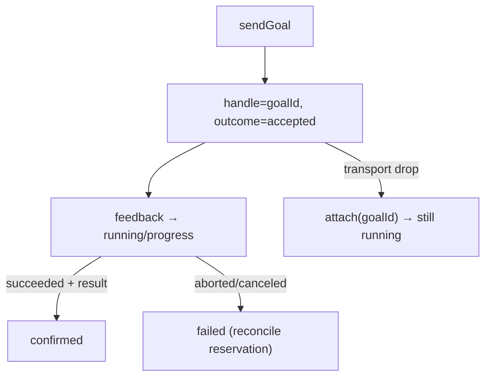

# RFC-026: ROS 2 Action Semantics & Nav2 Profile — Extending `@totemsdk/edge-ros2`

**Status:** Draft — design specification
**Created:** 2026-09-30
**Authors:** Totem SDK Contributors
**Reviewers:** [Pending stakeholder assignment]
**Depends on:** RFC-022 (Prepared-Command Binding & Async Lifecycle), RFC-021, RFC-023, RFC-011
**Touches:** `@totemsdk/edge-ros2` (existing package), `@totemsdk/industrial-action`

---

## 1. Summary

`@totemsdk/edge-ros2` today exposes ROS 2 **topics** (publish/subscribe) and
**services** (call/reply) through an injected `Ros2TransportPort`
(`packages/edge-ros2/src/transport.ts:9`, `gateway.ts:22`). It has no contract for
ROS 2 **actions** — the long-running, goal-oriented primitive that Nav2 and most
robot behaviours actually use (`NavigateToPose`, `FollowWaypoints`, etc.).

This RFC extends the existing package (rather than adding a new one) with a ROS 2
action-client contract — goal IDs, feedback, result retrieval, cancellation and
reconnect — and specifies a Nav2 profile: navigate to approved destinations,
follow waypoints, cancel goals, and observe results. This is the first adapter
that maps *natively* onto RFC-022's async lifecycle, because ROS 2 actions were
designed for exactly these semantics.

Totem supplies destination authority, bounded execution (speed/geofence/duration
via RFC-023) and evidence; Nav2 owns path planning, obstacle avoidance and the
control loop.

> **External facts in this RFC are hypotheses to verify and pin, not
> established claims.** See §9.

## 2. Motivation

### 2.1 The gap, with evidence

- The transport port has `createPublisher`/`createSubscription`/`createClient`
  (services) and no action client (`transport.ts:9`).
- `Ros2Gateway` exposes `callService` but no goal/feedback/result/cancel
  (`gateway.ts:31`).
- RFC-022 introduces durable operation handles, progress, cancellation and
  reconciliation — ROS 2 actions already define these (`goal_id`, feedback,
  result, cancel), so the mapping is direct and the missing piece is the
  transport contract.

### 2.2 Why ground vehicles next

Mobile robots already have a rich, standard action vocabulary; adding it
validates RFC-022 against a system whose native model matches Totem's, which is
the strongest evidence that the async design is correct rather than invented.

## 3. Goals

1. Add a ROS 2 **action-client** contract to `Ros2TransportPort` and
   `Ros2Gateway`, alongside the existing topics/services.
2. Map action goals onto RFC-022 durable handles and progress.
3. Provide a Nav2 profile: `NavigateToPose`, `FollowWaypoints`, `CancelGoal`,
   and result observation.
4. Derive physical effects (speed, duration, destination envelope) for RFC-023.
5. Preserve the existing topics/services contract unchanged.

## 4. Non-goals

- Path planning, obstacle avoidance or control — owned by Nav2.
- Replacing the DDS layer; the caller still injects the transport.
- Autonomous driving (that is RFC-027, built on this action contract).

## 5. Design

### 5.1 Action contract (additive to the transport port)

```ts
export interface Ros2ActionClient {
  /** Send a goal; returns immediately with a durable goal id. */
  sendGoal(goal: Ros2ActionGoal): Promise<{ goalId: string }>;
  /** Poll feedback/status; the adapter surfaces this as RFC-022 progress. */
  getFeedback(goalId: string): Promise<Ros2ActionFeedback | undefined>;
  /** Retrieve the terminal result, if the goal has completed. */
  getResult(goalId: string, timeoutMs?: number): Promise<Ros2ActionResult | undefined>;
  /** Request cancellation; best-effort, result is `unknown` until observed. */
  cancel(goalId: string): Promise<void>;
  /** (Re)attach to an in-flight goal after reconnect/restart. */
  attach(goalId: string): Promise<Ros2ActionFeedback | undefined>;
}

export interface Ros2TransportPort {
  // …existing…
  createActionClient(action: string, actionType: string): Promise<Ros2ActionClient>;
}

export interface Ros2ActionGoal {
  id: string;                    // client-side correlation id
  action: string;                // e.g. '/navigate_to_pose'
  actionType: string;            // e.g. 'nav2_msgs/action/NavigateToPose'
  goal: Ros2Message;             // serialised goal payload
}

export interface Ros2ActionFeedback {
  goalId: string;
  status: 'accepted' | 'executing' | 'canceling' | 'succeeded' | 'aborted' | 'canceled' | 'unknown';
  /** Nav2-style progress (0..1) and remaining distance, when present. */
  progress?: { fraction?: number; remainingMetres?: string; detail?: string };
  at: number;
}

export interface Ros2ActionResult {
  goalId: string;
  status: Ros2ActionFeedback['status'];
  result?: Ros2Message;
}
```

`Ros2Gateway` gains `sendAction`, `getFeedback`, `getResult`, `cancelAction`,
`attachAction` mirroring `callService` (`gateway.ts:31`).

### 5.2 Mapping to RFC-022

| ROS 2 action concept | RFC-022 concept |
|---|---|
| `sendGoal` → goal id | durable `handle` |
| feedback | `progress` (fraction/detail) |
| status `accepted`/`executing` | non-terminal (`accepted`/`running`) |
| status `succeeded` | `confirmed` (after result/readback) |
| status `aborted`/`canceled` | `failed`/`aborted` (after reconcile) |
| cancel + no result yet | `reconciling`; reservation held (RFC-019) |
| `attach` after restart | restart recovery (`OperationLifecycle.open`) |

The adapter sets `AsyncOperationSupport.confirmation = 'accepted'`; `reconcile`
calls `getFeedback`/`getResult`; `cancel` calls `cancel`; restart recovery uses
`attach`.

### 5.3 Nav2 profile

```ts
// A destination is a registered resource; the goal is bounded to it.
export interface DestinationMeta {
  readonly frameId: string;              // e.g. 'map'
  readonly x: string; readonly y: string; readonly yaw: string;
  readonly maxSpeedMetresPerSecond: string;
  readonly geofenceId?: string;
}

export interface WaypointPlan {
  readonly planId: string;
  readonly destinations: readonly string[];   // resource keys
  readonly planDigest: string;
}
```

Governed operations:

| Definition kind | Nav2 action | Effect | Failure mode | Async |
|---|---|---|---|---|
| `nav:navigateToPose` | `NavigateToPose` | write | `fail-safe` (stop) | accepted |
| `nav:followWaypoints` | `FollowWaypoints` | write | `fail-safe` | accepted |
| `nav:cancelGoal` | action cancel | write | `fail-safe` | accepted |
| `nav:readPose` | `amcl`/TF query | read | `fail-silent` | completed |

Safe-state is **stop / zero velocity**, declared per base resource.

### 5.4 Physical effects (RFC-023)

`deriveEffects` emits, from the prepared goal:

```ts
{
  physical: {
    speed:    [{ resource, metresPerSecond: min(goalSpeed, destinationMax) }],
    duration: [{ resource, seconds: plannedDurationCeiling }],
    envelopes:[{ envelopeId: planId, envelopeDigest: planDigest }],
  }
}
```

A goal outside the destination geofence or exceeding the plan's speed/duration is
refused by `checkRunLimits` before authorization. The plan digest binds the
navigate action to the exact waypoint set.

### 5.5 Reconnect and restart

DDS discovery can drop and re-establish. The contract requires that a goal id
survives a transport restart (`attach`), so:
- a reconnect does not silently create a second goal;
- a restarted host can re-attach to an in-flight goal and continue reconciling.



## 6. Compatibility

- Purely additive to `@totemsdk/edge-ros2`: existing topics/services unchanged.
- A transport that does not implement `createActionClient` simply cannot offer
  action-based definitions (capability-gated via RFC-021).

## 7. Security considerations

| Case | Behaviour |
|---|---|
| Goal to an unregistered destination | Rejected by the catalogue/resolver (RFC-021). |
| Speed/duration/geofence exceeded | RFC-023 boundary before authorization. |
| Duplicate goal after reconnect | Same goal id/`operationId`; `attach`, not re-send. |
| Cancel treated as success | `unknown` until observed; reservation held. |
| Feedback spoofed by caller | Feedback originates from the transport, not caller payload. |

## 8. Implementation plan

- **P0 — Action contract.** `Ros2ActionClient`, `createActionClient`, goal/
  feedback/result types.
- **P1 — Gateway methods.** `sendAction`/`getFeedback`/`getResult`/`cancelAction`/
  `attachAction`.
- **P2 — Adapter.** RFC-022 `AsyncOperationSupport` over the action client.
- **P3 — Nav2 profile.** Destinations, plans, governed operations, safe-state.
- **P4 — Physical effects.** speed/duration/geofence → RFC-023.
- **P5 — Reconnect/restart.** `attach` + recovery tests.
- **P6 — Simulation E2E.** Nav2 in simulation; adversarial case set.

## 9. External dependencies to verify and pin

> Claims from the originating review; unverified until the task is done.

| Claim | Verification task |
|---|---|
| Nav2 exposes long-running navigation actions (`NavigateToPose`, `FollowWaypoints`) | Confirm action names/types and goal/feedback/result fields |
| ROS 2 actions provide goal ids, feedback, result, cancellation | Confirm against the ROS 2 action interface |
| The existing transport lacks an action-client contract | Confirmed in-repo (`transport.ts`, `gateway.ts`); no external verification needed |
| A simulation harness is available for fault scenarios | Identify the simulator and integration path |

## 10. Open questions

- **Q1** Should the action contract live in `@totemsdk/edge-ros2` (proposed) or a
  shared `@totemsdk/edge-actions` abstraction reused by RFC-027?
- **Q2** How is "observed arrival" defined — action `succeeded`, TF readback, or
  both?
- **Q3** Do waypoint plans belong in the profile or in `industrial-action` core
  (shared with the flight mission envelope, RFC-025)?
- **Q4** What is the reconnect/attach policy when the original goal id is no
  longer known to the action server?

## 11. References

- `docs/rfc/RFC-011-INDUSTRIAL-ACTION-DOMAIN-MODEL.md` — profiles, safe-state
- `docs/rfc/RFC-021-INDUSTRIAL-CATALOGUE-DECISION-BINDING.md`
- `docs/rfc/RFC-022-PREPARED-COMMAND-BINDING-ASYNC-LIFECYCLE.md` — handle/progress/cancel/reconcile
- `docs/rfc/RFC-023-PHYSICAL-EFFECT-POLICY-ENFORCEMENT.md` — speed/duration/envelope
- `packages/edge-ros2/src/{transport,gateway,sensor-bridge}.ts`
