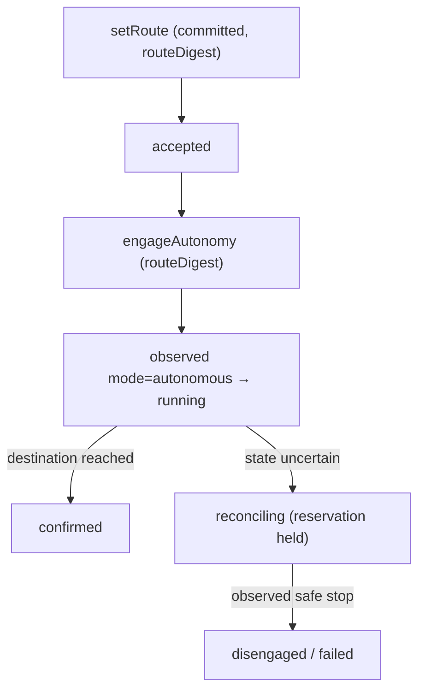

# RFC-027: Autoware Autonomous-Driving Profile — External Operation over the ROS 2 Action Contract

**Status:** Draft — design specification
**Created:** 2026-09-30
**Authors:** Totem SDK Contributors
**Reviewers:** [Pending stakeholder assignment]
**Depends on:** RFC-026 (ROS 2 Action Semantics & Nav2), RFC-021, RFC-022, RFC-023, RFC-011
**Touches:** `@totemsdk/industrial-autoware` (or `@totemsdk/edge-ros2/autoware` subpath); `@totemsdk/industrial-action`

---

## 1. Summary

Autoware exposes an **AD API** for operating an autonomous vehicle from *outside*
the driving system — routing, permitted operation-mode changes, and monitoring.
This RFC defines an Autoware profile over the ROS 2 action/service contract built
in RFC-026: set routes, request permitted operation-mode changes, and observe
vehicle state, all authorized and evidenced through the governed runtime.

This is the highest-consequence adapter, so it is deliberately **last**: it
depends on the RFC-021 catalogue (bounded selection), RFC-022 lifecycle
(accepted ≠ completed), RFC-023 physical limits (speed/envelope/duration) and
RFC-026's action contract being proven. Totem supplies route authority, bounded
execution and evidence; **Autoware owns perception, planning, control and the
safety monitor.** No Totem command overrides the vehicle's safety monitor.

> **External facts in this RFC are hypotheses to verify and pin, not
> established claims.** See §9.

## 2. Motivation

### 2.1 Why Autoware, and why last

Autoware's AD API is explicitly designed for external operation, which is exactly
Totem's role: authorize *what* and *where*, let the driving system own *how*. It
is also the domain with the least tolerance for the defects RFC-022 addresses:
conflating acceptance with completion, or losing a route-change acknowledgment,
is safety-relevant. Sequencing it after the flight and mobile-robot profiles
means the lifecycle is already validated against systems with native async
semantics (ROS 2 actions) and telemetry readback.

### 2.2 What exists

- No autonomous-driving adapter exists today.
- RFC-026 provides the ROS 2 action-client contract this profile builds on.

## 3. Goals

1. An Autoware profile: vehicle resources, operation-mode interlocks,
   route/zone envelopes, and governed definitions.
2. Set routes, request operation-mode changes, and monitor vehicle state through
   the RFC-026 action/service contract.
3. Enforce speed/zone/duration limits (RFC-023) from the prepared command.
4. Reconcile accepted route/mode commands against observed vehicle state.
5. A simulation harness (e.g. CARLA) for fault and edge-case scenarios.

## 4. Non-goals

- Perception, planning, control or the safety monitor — owned by Autoware.
- Overriding or bypassing the vehicle's safety monitor under any circumstance.
- Remote direct actuation (steering/throttle) — never governed here.
- Regulatory approval for public-road operation — deployment responsibility.

## 5. Design

### 5.1 Package shape

```
@totemsdk/industrial-autoware
  src/transport.ts      reuses @totemsdk/edge-ros2 Ros2TransportPort
  src/adapter.ts        AD API operations → PreparedDeviceOp + reconcile/cancel
  src/profile.ts        IndustrialProfile: vehicle resources, interlocks, taxonomy
  src/route.ts          Route/zone envelope + digest
  src/modes.ts          Operation-mode model (permitted transitions)
  src/effects.ts        deriveEffects → PhysicalEffects (speed/duration/zone)
  src/simulation.ts     CARLA (or equivalent) harness for fault scenarios
```

The transport is **RFC-026's** `Ros2TransportPort`; this profile adds no new
transport, only AD-specific actions/services and semantics.

### 5.2 Governed operations

| Definition kind | AD API operation | Effect | Failure mode | Async |
|---|---|---|---|---|
| `drive:setRoute` | set route / destination | write | `fail-safe` (stop) | accepted |
| `drive:requestMode` | request operation mode | write | `fail-closed` | accepted |
| `drive:engageAutonomy` | engage autonomous mode | write | `fail-closed` | accepted |
| `drive:disengage` | disengage to safe stop | write | `fail-safe` | accepted |
| `drive:readState` | vehicle state / localization | read | `fail-silent` | completed |
| `drive:cancelRoute` | cancel current route | write | `fail-safe` | accepted |

Safe-state is **controlled stop / disengage**, declared per vehicle. Mode changes
use `fail-closed`: an unconfirmed mode change locks out until an operator
confirms the actual vehicle state.

### 5.3 Route and zone envelope

```ts
export interface RouteEnvelope {
  readonly envelopeId: string;
  readonly vehicle: string;
  readonly routeId: string;
  readonly waypoints: readonly GeoPoint[];
  readonly operationalDesignDomain?: string;  // permitted ODD / zone id
  readonly maxSpeedMetresPerSecond: string;
  readonly maxDurationSeconds: string;
}
export function routeDigest(envelope: RouteEnvelope): string;
```

`setRoute` prepares and commits the route; `engageAutonomy` is authorized against
`routeDigest`, so engagement cannot reference a different route than the one
authorized. RFC-023 enforces speed/duration/zone membership from derived effects.

### 5.4 Operation modes and interlocks

```ts
export type DriveMode = 'manual' | 'autonomous' | 'taking-over' | 'minimal-risk-stop';
export interface ModeTransition { readonly from: DriveMode; readonly to: DriveMode; }
```

- Permitted transitions are declared; anything else is rejected at registration.
- Mode-change interlocks (RFC-011 §4.3) guard prerequisites (e.g. route set,
  localization healthy, ODD valid).
- `taking-over` and `minimal-risk-stop` are **always permitted inbound** — Totem
  never blocks a vehicle's transition toward a safer state, regardless of mandate.

### 5.5 Async lifecycle and state reconciliation

1. `setRoute` dispatch; AD API acceptance ⇒ `accepted`.
2. `reconcile` observes vehicle state/localization; route active and vehicle
   progressing within the envelope ⇒ `running`.
3. Route completion at the destination (position tolerance) ⇒ `confirmed`.
4. Mode changes: only observed vehicle state (`readState`) confirms a mode
   transition; an accepted request alone ⇒ `reconciling` with the reservation
   held (RFC-019).
5. `disengage`/`cancelRoute` ⇒ `unknown` until observed state confirms.



### 5.6 Physical effects (RFC-023)

```ts
{
  physical: {
    speed:    [{ resource, metresPerSecond: routeMaxSpeed }],
    duration: [{ resource, seconds: routeDurationCeiling }],
    envelopes:[{ envelopeId: routeId, envelopeDigest: routeDigest }],
  }
}
```

### 5.7 Simulation and fault scenarios

`simulation.ts` drives a simulated vehicle (e.g. CARLA) to exercise: route
rejection, mode-change refusal, localization loss, communication dropout,
unexpected takeover, and safe-stop failure. These are the RFC-022 adversarial
cases plus driving-specific fault injection.

### 5.8 Error taxonomy

Register AD API error/status codes: safety-monitor intervention /
minimum-risk-stop (`safety`), route invalid / ODD violation (`permanent`),
localization timeout (`transient`), mode not permitted (`auth`/`permanent`). A
`safety` classification commands safe-state and never retries; it never
overrides the safety monitor.

## 6. Compatibility

- New package (or subpath) built on RFC-026; no change to existing packages.
- Requires RFC-026's action contract; without it, this profile is unavailable.

## 7. Security considerations

| Case | Behaviour |
|---|---|
| Engage without an authorized route | `routeDigest` mismatch → rejected. |
| Route exceeds speed/zone/duration mandate | RFC-023 boundary before authorization. |
| Mode change accepted but not observed | `reconciling`; reservation held; operator confirmation required for lockout. |
| Attempt to override the safety monitor | Impossible: Totem issues requests to the AD API; the safety monitor is authoritative and out of scope. |
| Safer-state transition | Always permitted, independent of mandate. |
| Caller asserts vehicle state | State comes from `readState` via the transport, never caller payload. |

## 8. Implementation plan

- **P0 — Package.** Skeleton on RFC-026 transport.
- **P1 — Route envelope.** Model, digest, validation; geospatial units.
- **P2 — Operations.** Set-route, mode-request, engage, disengage, read-state,
  cancel with RFC-022 async support.
- **P3 — Modes/interlocks.** Permitted transitions + safer-state exception.
- **P4 — Physical effects.** speed/duration/zone → RFC-023.
- **P5 — State reconciliation.** Observed-mode and route-progress confirmation.
- **P6 — Simulation.** CARLA fault scenarios + RFC-022 adversarial case set.

## 9. External dependencies to verify and pin

> Claims from the originating review; unverified until the task is done.

| Claim | Verification task |
|---|---|
| Autoware provides an AD API intended for external vehicle operation | Confirm API surface: routing, operation modes, monitoring |
| The AD API exposes route and mode operations | Confirm action/service names, types, feedback/result |
| CARLA is usable for simulation and fault scenarios | Confirm version and the Autoware↔CARLA integration path |
| Operation-mode transitions have defined permitted sets | Confirm against Autoware docs; derive the transition model |

## 10. Open questions

- **Q1** Should this be its own package or a subpath of `@totemsdk/edge-ros2`
  (`@totemsdk/edge-ros2/autoware`), given it shares the transport?
- **Q2** Are route and mission envelopes (RFC-025) the same core abstraction?
  Should there be one `Envelope` concept in `industrial-action`?
- **Q3** What position/timing tolerance defines route completion per vehicle?
- **Q4** How is operator confirmation of a locked-out mode change modelled —
  RFC-011 approvals, or an out-of-band safety procedure?

## 11. References

- `docs/rfc/RFC-011-INDUSTRIAL-ACTION-DOMAIN-MODEL.md` — interlocks, failure semantics
- `docs/rfc/RFC-021-INDUSTRIAL-CATALOGUE-DECISION-BINDING.md`
- `docs/rfc/RFC-022-PREPARED-COMMAND-BINDING-ASYNC-LIFECYCLE.md`
- `docs/rfc/RFC-023-PHYSICAL-EFFECT-POLICY-ENFORCEMENT.md`
- `docs/rfc/RFC-026-ROS2-ACTION-NAV2-PROFILE.md` — transport/action contract
- `packages/edge-ros2/src/{transport,gateway}.ts`
