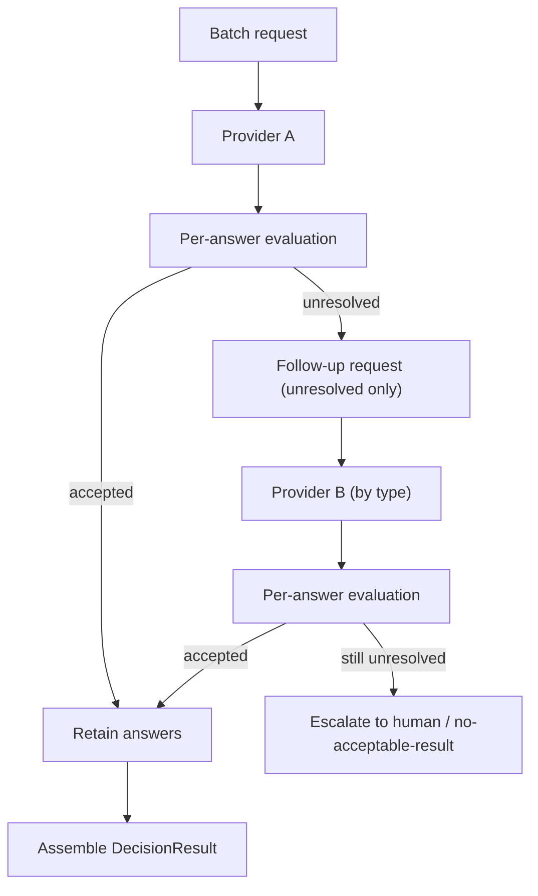

# RFC-029: Per-Question Acceptance & Multi-Provider Assembly

**Status:** Draft — design specification
**Created:** 2026-10-01
**Authors:** Totem SDK Contributors
**Reviewers:** [Pending stakeholder assignment]
**Depends on:** RFC-012 (Decision Runtime), RFC-028 (Output Correctness & Native Bridges), RFC-017 (Decision Receipt Graph)
**Touches:** `@totemsdk/decision` (`acceptance.ts`, `runtime.ts`, `validation.ts`, `types.ts`, `canonical.ts`, `receipts.ts`)

---

## 1. Summary

Acceptance today is evaluated **per route over the whole decision**: a batch-wide
`minConfidence` requires every answer to clear the same threshold, and
`aggregateConfidence` returns `undefined` if *any* answer lacks a confidence value
(`packages/decision/src/acceptance.ts:68-80`). This is why one valid Jev `noul`
answer — which has no separate confidence field — can reject an entire batch of
otherwise-good Choice answers.

This RFC makes acceptance **per question and per decision type**, preserving
accepted answers and escalating only the unresolved ones. To do so it introduces
an **assembly** step that can draw answers from more than one provider, recording
each answer's provider and bindings. It keeps semantic, authority and
confidence/calibration strictly distinct (RFC-017 trust boundary).

## 2. Motivation

### 2.1 Batch-wide rules are the efficiency bottleneck

- `evaluateAcceptance` applies `minConfidence` to a single `confidence` value for
  the whole decision (`acceptance.ts:90-94`), computed as the **minimum** across
  answers (`acceptance.ts:68-80`).
- A probability answer with no `confidence` (`answerConfidence` returns
  `undefined`, `acceptance.ts:33-34`) makes the aggregate `undefined`, so
  `minConfidence` fails the entire batch even when the Choice answers are strong.
- Jev `Noul` answers carry no separate confidence field (a claim to verify, §9),
  so this is not hypothetical.

### 2.2 A `DecisionSuccess` is single-provider today

The runtime returns one accepted `DecisionResult` from one provider
(`runtime.ts:415-431`). There is no defined way to take a Choice answer from one
provider and a Probability answer from another, nor to record which provider
produced which answer. Assembly is a prerequisite for selective escalation.

### 2.3 Three different "confidence" notions must not collapse

Decision already separates `DecisionConfidence.source`
(`provider | selected_probability | derived`, `validation.ts:275-283`). This RFC
extends that separation explicitly to **provider confidence**, **selected
probability**, and **measured calibration**, and forbids silent substitution.

## 3. Goals

1. Type-keyed acceptance rules: choice, score and probability evaluated on their
   own appropriate signals.
2. Partial acceptance: accepted answers are retained; only unresolved questions
   are escalated (to another provider, a narrower route, or a human).
3. Multi-provider assembly with per-answer provider + bindings recorded.
4. Provider confidence, selected probability and calibration kept distinct and
   explicit; no silent substitution.
5. Preserve the RFC-017 boundary: a semantic decision grants nothing, and an
   assembled result is still advisory evidence only.

## 4. Non-goals

- Preflight, shortlisting and batching — RFC-030.
- Changing `authorizeAndReserve` or the edge runtime.
- Making an assembled decision an authorization; it remains a proposal.
- Re-specifying RFC-028's output-correctness fixes.

## 5. Design

### 5.1 Per-type acceptance rules

Generalize `DecisionAcceptanceRule` into a type-keyed structure while keeping the
existing flat fields as a back-compatible default (applied to every question
type). New nested rules:

```ts
export interface ChoiceAcceptance {
  readonly minConfidence?: number;
  readonly minSelectedProbability?: number;
  /** Minimum margin between the selected and runner-up probabilities. */
  readonly minMargin?: number;
  /** Maximum normalized Shannon entropy (complete distributions only). */
  readonly maxEntropy?: number;
}

export interface ScoreAcceptance {
  /** Minimum/maximum acceptable expected value. */
  readonly minExpectedScore?: number;
  readonly maxExpectedScore?: number;
  /** Maximum normalized entropy of the level distribution. */
  readonly maxDistributionEntropy?: number;
  /** Minimum selected-level probability, when a distribution is present. */
  readonly minSelectedProbability?: number;
}

export interface ProbabilityAcceptance {
  /** Explicit true region: accept when probabilityTrue ≥ this. */
  readonly minProbabilityTrue?: number;
  /** Explicit false region: accept when probabilityTrue ≤ this. */
  readonly maxProbabilityTrue?: number;
  /**
   * Explicit uncertain band. When set, an answer whose probabilityTrue falls in
   * [minProbabilityTrue, maxProbabilityTrue] is *unresolved* rather than
   * rejected — it escalates instead of failing the batch.
   */
  readonly uncertain?: { readonly low: number; readonly high: number };
}

export interface DecisionAcceptanceRule {
  // …existing flat fields (defaults for all types)…
  readonly byType?: {
    readonly choice?: ChoiceAcceptance;
    readonly score?: ScoreAcceptance;
    readonly probability?: ProbabilityAcceptance;
  };
  /** Action operation/target heads use the choice rules. */
  readonly action?: ChoiceAcceptance & {
    readonly minOperationProbability?: number;
    readonly minTargetProbability?: number;
  };
}
```

Evaluation order per answer: the flat rule first (back-compat), then the
type-specific rule. A rule may mark an answer **accepted**, **rejected**, or
**unresolved** (§5.2).

### 5.2 Per-answer evaluation

```ts
export type AnswerVerdict = 'accepted' | 'unresolved' | 'rejected';

export interface AnswerEvaluation {
  readonly questionId: string;
  readonly verdict: AnswerVerdict;
  readonly reason?: DecisionEscalationReason;
}
```

- **accepted** — all applicable thresholds met; the answer is retained.
- **unresolved** — the answer is valid but not decisive (e.g. a probability in the
  uncertain band, or missing a signal the rule does not require). It is escalated,
  not counted as a batch failure.
- **rejected** — the answer is malformed or violates a hard rule (already handled
  by validation in RFC-028; acceptance does not re-validate).

`evaluateAcceptance` gains a per-answer variant; the existing whole-decision
result is derived from the per-answer verdicts: **a decision is accepted iff
every answer is `accepted`** (rejected and unresolved both prevent whole-decision
acceptance, but only unresolved answers are eligible for assembly).

### 5.3 Partial acceptance and selective escalation

The runtime, when a route yields some accepted and some unresolved answers:

1. Retains the accepted answers.
2. Builds a **follow-up request** containing only the unresolved questions, with
   the same state snapshot (RFC-030 §5.4) and a fresh `requestId`.
3. Sends the follow-up to the configured fallback route/provider for those types.
4. Assembles a final result from retained + newly-accepted answers.



Escalation semantics (unchanged contract): partial acceptance **never** silently
drops an unresolved question. If no provider resolves it, the outcome is
`NO_ACCEPTABLE_RESULT` (or `requires_human` upstream), not a partial success
presented as complete.

### 5.4 Multi-provider assembly

A new runtime capability, opt-in per route via `allowAssembly`:

```ts
export interface AssembledAnswer<T = DecisionAnswer> {
  readonly answer: T;
  /** The provider that produced this answer. */
  readonly provider: DecisionProviderRef;
  /** Bindings under which this answer was produced (request digest is per-question-subset). */
  readonly bindings: DecisionRequestBindings;
  /** The attempt that yielded the answer. */
  readonly attemptIndex: number;
}

export interface AssembledDecisionResult {
  readonly kind: 'questions';
  readonly answers: readonly AssembledAnswer[];
  /** Providers that contributed accepted answers, de-duplicated, in order. */
  readonly providers: readonly DecisionProviderRef[];
}
```

- Each answer records its **own** provider and bindings, because the per-question
  request digest differs from the original batch digest.
- The assembled result carries a **composite candidate set digest** plus a
  **per-answer binding list**, so the receipt can be verified without assuming a
  single provider or a single request digest.
- Assembly is only attempted when the configured routes permit it; a single-
  provider batch is the degenerate one-provider case and behaves as today.

### 5.5 Receipts and digests for assembled results

`DecisionReceipt` binds one `outputDigest`. For assembled results we add an
**assembly receipt** rather than overloading the single-provider receipt:

```ts
export interface DecisionAssemblyReceipt {
  readonly version: 1;
  readonly assemblyId: string;              // derived, like receiptId
  readonly requestId: string;
  readonly stateDigest: string;
  /** Per-answer provider + bindings, in answer order. */
  readonly contributions: readonly {
    readonly questionId: string;
    readonly provider: DecisionProviderRef;
    readonly requestDigest: string;
    readonly outputDigest: string;
  }[];
  readonly issuedAt: number;
  readonly durationMs?: number;
}
```

This keeps **one semantic decision ↔ one evidence node** (RFC-017): the assembly
receipt is the node a `DecisionRef` points at, and its `outputDigest` covers the
assembled result. Per-contribution digests let the graph show *which* provider
answered *which* question without conflating authority.

### 5.6 Keeping confidence, selected probability and calibration distinct

Extend `DecisionConfidence` usage with an explicit, non-substituting model:

```ts
export interface AnswerSignals {
  /** Provider-asserted confidence, if any. */
  readonly providerConfidence?: DecisionConfidence;
  /** Selected probability derived from a distribution, if any. */
  readonly selectedProbability?: DecisionConfidence;   // source: 'selected_probability'
  /** Measured calibration for the provider/model, if supplied. */
  readonly calibration?: { readonly value: number; readonly source: 'measured' };
}
```

Rules:

- `minConfidence` reads **provider confidence only**; it never falls back to
  selected probability unless the rule explicitly sets
  `allowSelectedProbabilityAsConfidence` (default `false`). This preserves the
  current `DecisionConfidence.source` distinction
  (`validation.ts:275-283`) but stops implicit substitution in acceptance.
- `minSelectedProbability` reads selected probability (already the case,
  `acceptance.ts:96-99`).
- Calibration is **reported and retained**, never used as a threshold unless a
  rule explicitly opts in. It is not a probability.
- `aggregateConfidence` keeps returning the minimum across answers for
  back-compat, but acceptance no longer depends on it for per-type rules.

## 6. Compatibility

- Flat `DecisionAcceptanceRule` fields remain the default for all types; existing
  routes behave unchanged unless `byType`/`action` is set.
- Assembly is opt-in (`allowAssembly`); default single-provider behaviour is
  identical to today.
- `DecisionAssemblyReceipt` is additive; `DecisionRef` (RFC-017) can point at an
  assembled result via its `outputDigest`.
- The stricter "provider confidence only" default for `minConfidence` is a `0.x`
  behaviour change for routes that implicitly relied on selected-probability
  fallback; `allowSelectedProbabilityAsConfidence: true` restores it.

## 7. Security considerations

| Case | Behaviour |
|---|---|
| One weak answer fails a strong batch | Removed: unresolved answers escalate individually. |
| Unresolved question silently dropped | Impossible: must be resolved or the outcome is `NO_ACCEPTABLE_RESULT`. |
| Mixed providers smuggled as one decision | Each answer records its provider + bindings; the assembly receipt lists contributions. |
| Calibration used as an acceptance threshold | Only if a rule explicitly opts in; otherwise report-only. |
| Selected probability passed off as provider confidence | Blocked by default; requires explicit opt-in. |
| Assembly used to bypass authority | Assembly is advisory evidence; `authorizeAndReserve` is unaffected (RFC-017). |

## 8. Implementation plan

- **P0 — Per-answer evaluation.** `AnswerVerdict`, `AnswerEvaluation`,
  `byType`/`action` rules; back-compat flat defaults.
- **P1 — Partial acceptance.** Retain accepted answers; follow-up request for
  unresolved; `NO_ACCEPTABLE_RESULT` when unresolved.
- **P2 — Assembly.** `AssembledDecisionResult`, `AssembledAnswer`, per-answer
  provider + bindings; `allowAssembly` route option.
- **P3 — Receipts.** `DecisionAssemblyReceipt`; `DecisionRef` compatibility.
- **P4 — Signals.** `AnswerSignals`; provider-confidence-only default;
  calibration report-only.
- **P5 — Tests.** (a) mixed Choice+Noul batch accepts all when each is valid;
  (b) unresolved escalates and is not dropped; (c) two-provider assembly records
  both providers; (d) receipt verifies; (e) calibration/selected-probability
  never substitute unless opted in.

## 9. External dependencies to verify and pin

| Claim | Verification task |
|---|---|
| Jev `Noul` answers have no separate confidence field | Confirm against the Jev client (pairs with RFC-028 §9) |
| A provider may be unable to answer some types a batch contains | Confirm per-type capability routing; scope `byType` defaults |

## 10. Open questions

- **Q1** Should `allowAssembly` be a route option (proposed) or a runtime-level
  policy?
- **Q2** Should the follow-up request reuse the parent `requestId` as a suffix
  (traceable) or take a fresh id (clean cancellation)?
- **Q3** Is `DecisionAssemblyReceipt` a new type (proposed) or should the existing
  receipt gain a `contributions[]` and become polymorphic?
- **Q4** When an unresolved answer escalates to a human, is that a runtime
  `requires_human` outcome or an application concern above Decision?

## 11. References

- `docs/rfc/RFC-012-DECISION-RUNTIME.md` — acceptance, routing, trust boundary
- `docs/rfc/RFC-017-DECISION-RECEIPT-GRAPH.md` — one semantic node, inert evidence
- `docs/rfc/RFC-028-DECISION-OUTPUT-CORRECTNESS-NATIVE-BRIDGES.md` — validation, native bridges
- `docs/rfc/RFC-030-MODEL-AWARE-PREFLIGHT-SHORTLISTING-BATCHING.md` — preflight/shortlisting/batching
- `packages/decision/src/{acceptance,runtime,types,receipts,canonical}.ts`
